THE BOGI

Einführung in den Battle Of Glorious Ideas

# Inhalt

[*BOGI – Battle Of Glorious Ideas* 4](#bogi-battle-of-glorious-ideas)

[Einleitung 4](#einleitung)

[BOGI Kurzbeschreibung 5](#bogi-kurzbeschreibung)

[Anwendungsgebiete 6](#anwendungsgebiete)

[Motivation 8](#motivation)

[Einschränkungen 14](#einschränkungen)

[*BOGI* vs. andere Methoden 17](#bogi-vs.-andere-methoden)

[Vorteile des *BOGI* 22](#vorteile-des-bogi)

[Minimale Risiken 23](#minimale-risiken)

[Implizite Vorteile 24](#implizite-vorteile)

[Explizite Vorteile 27](#explizite-vorteile)

[Lohnt sich der *BOGI* / Wie ist mein ROI?
28](#lohnt-sich-der-bogi-wie-ist-mein-roi)

[Abgrenzung: Was ist der *BOGI* nicht?
33](#abgrenzung-was-ist-der-bogi-nicht)

[Voraussetzungen / allgemeine Empfehlungen
35](#voraussetzungen-allgemeine-empfehlungen)

[*BOGI* MECHANICS 41](#bogi-mechanics)

[*BOGI* Rollen 42](#bogi-rollen)

[*BOGI* SPONSOR 42](#bogi-sponsor)

[*BOGI* MODERATOR 43](#bogi-moderator)

[*BOGI* INCEPTORS 45](#bogi-inceptors)

[*BOGI* GUIDE 45](#bogi-guide)

[DAS *BOGI* BOARD 48](#das-bogi-board)

[Veranstaltungen im *BOGI* 52](#veranstaltungen-im-bogi)

[*BOGI* SESSION (~ the weekly arena) 54](#bogi-session-the-weekly-arena)

[*BOGI* HACKATHON 73](#bogi-hackathon)

[*BOGI* Hygiene 84](#bogi-hygiene)

[BOGI TIPPS & TRICKS 90](#bogi-tipps-tricks)

[Einladungen, Trigger und Motivation
90](#einladungen-trigger-und-motivation)

[*BOGI* Tweaks 92](#bogi-tweaks)

[Beliebte BOGI HACKS & TWEAKS 93](#beliebte-bogi-hacks-tweaks)

[Weitere Hinweise und Links 100](#weitere-hinweise-und-links)

# *BOGI – Battle Of Glorious Ideas*

Ring frei für den **BATTLE OF GLORIOUS IDEAS!**

Oder: Willkommen bei der Einführung in den BOGI!

## Einleitung

*B.O.G.I.* bedeutet *Battle Of Glorious Ideas* - die Schlacht der
glorreichen Ideen! Der *BOGI* ist ein schlankes Vorgehensmodell für
Ideenfindung, -auswahl und – umsetzung im Team. Damit stellt der *BOGI*
eine einfache Methode dar, die die strukturierte Innovation in
Organisationen unterstützen und fördern soll. Ursprünglich wurde der
BOGI in der Praxis entwickelt und erprobt. Ideen und Konzepte aus
anderen theoretischen Methoden fließen hier mit ein. Inspiriert sind
Anteile des *BOGI* etwa durch das Stage-Gate ® Modell, die
KANBAN-Methode und das Format von
*[Hackathons](https://de.wikipedia.org/wiki/Hackathon).* Das Ziel war
es, einen schlanken, skalierbaren Ansatz zu finden, der in Gruppen oder
über Gruppen hinweg funktionieren und auf spezifische Bedürfnisse hin
angepasst werden kann. So ist der *BOGI* als Angebot an Organisationen
zu verstehen, die mit einer systematischen Bearbeitung von Ideen sich
selbst und das interne Innovationspotential weiterentwickeln wollen. Der
*BOGI* ist von Sebastian Benderoth beschrieben worden und wird als
grundlegendes Framework für die Allgemeinheit zugänglich gemacht.
Lizenzhinweise finden Sie unter [online auf
github](https://github.com/gridster/BOGI_v1/blob/master/LICENSE.txt).

## BOGI Kurzbeschreibung

Der *Battle Of Glorious Ideas* (*BOGI*) ist ein praxisorientiertes
Modell für die kontinuierliche Sammlung und Selektion von Ideen im Team.
Als effizientes Framework stellt der *BOGI* Prozessvorlagen und Tools
für die Durchführung der Arbeit mit vielen Ideen zur Verfügung. Der
*BOGI* sieht eine regelmäßige *BOGI* SESSION als taktgebenden
Arbeitskreis vor. Eine Sitzung besteht aus zwei Teilen. In dem ersten
Teil werden neue Ideen kurz und prägnant von den Teilnehmern, die eine
Idee vorstellen möchten präsentiert und ad hoc vom Team bewertet (was
zur Aufnahme oder Ablehnung eines Ideenkandidaten führt). Im zweiten
Teil der Veranstaltung werden die besten Ideen aus einem Pool aller
bisher aufgenommenen Ideen durch Abstimmung selektiert. Selektierte
Ideen qualifizieren sich weiter und werden zu *Battle Candidates*
aufgewertet. Diese werden im *BOGI* BOARD fließend dokumentiert und
verwaltet. So eine *BOGI* SESSION findet acht Mal statt und liefert
weitere *Battle Candidates*. Diese *BOGI* *Sequenz* wird mit dem
HACKATHON abgeschlossen. Er dient der realitätsnahen Ausarbeitung oder
Prototypenerstellung von *Battle Candidates*. Die teilnehmenden Teams
bzw. Teammitglieder selektieren dafür jeweils einen Kandidaten aus dem
*BOGI* BOARD. Die Prototypen und Ergebnisse werden im Anschluss in
größerem Rahmen innerhalb der Organisation präsentiert. Letztlich werden
alle Ergebnisse für die Kommunikation aufbereitet, so dass alle
wertvollen Ideen nach einer Sequenz jeweils mit geeignetem Publikum
getestet werden können. Das Ziel des *BOGI* ist es, eine Plattform für
die kontinuierliche Arbeit an Ideen, Innovationskandidaten, Konzepten
oder Prozessen zu definieren. Das Framework führt dazu die
Ideensammlung, Diskussion und Qualifizierung, Prototypenerstellung sowie
Dokumentation bzw. Aufbereitung für Folgeschritte zusammen. Damit der
*BOGI* an die situativen Gegebenheiten verschiedener Teams und
Organisationen optimal angepasst werden kann, ist das Framework in
vielen Aspekten offen gestaltet. Zusätzliche Methoden, Prozesse und
bereits existierende Best Practices können dadurch mit in den *BOGI*
einfließen. Weiterhin werden Vorschläge in Form von Tools (wie etwa
Battlecards für Ideen) und Konzepte vorgestellt. Darunter sind etwa
bestimmte *BOGI* Rollen zu nennen. So ergibt sich eine organisatorische
Blaupause für den Innovationsalltag, der für Organisationen
unterschiedlicher Größe und aus verschiedenster Branchen funktioniert.

## Anwendungsgebiete

-   Grundsätzlich: Ideensammlung, Selektion von Innovationskandidaten,
    Tests unter verschiedenen Bedingungen

-   Diskussion von Weiterentwicklungsoptionen, Screening und
    Vorqualifikation für Produkterweiterungen und die Entwicklung neuer
    Produkte oder Leistungen

-   Aufnahme und Bewertung von Kundenfeedback für die Weiterentwicklung
    eines existierenden Serviceangebots oder für die Optimierung von
    Dienstleistungen

-   Sammlung von Maßnahmen & Hypothesen für Ihre Content-Strategie sowie
    Marketing- oder Growth Hacking Aktivität

-   Stärkung der Teamfähigkeiten und der teamübergreifenden Kooperation
    auf der Grundlage schlanker Abläufe und partizipatorischer Anreize

-   Realisierung von Prototypen für das Testen von Innovationskandidaten
    am Markt oder bei ausgewählten Personenkreisen

-   Die kontinuierliche Praxis hinsichtlich der Bewertung von
    Opportunitäten oder Business Cases

Der *BOGI* ist, wie eingangs angedeutet, flexibel an unterschiedliche
Bedürfnisse und Vorgaben anpassbar. Er lässt sich mit anderen Methoden
kombinieren und ist so nicht auf bestimmte Anwendungsbereiche limitiert.
Aus diesem Grund lässt sich das Framework für solche Vorgänge
adaptieren, in denen Innovation und organisatorische Erneuerungs- bzw.
Anpassungsvorgänge im Fokus stehen. Der *BOGI* ist also nicht nur für
beispielsweise die Produktentwicklung interessant, sondern kann
ebenfalls partizipatorische Change-Prozesse unterstützen.

Für die einfache Implementierung bietet der *BOGI* ein schlankes Set von
Vorlagen und Vorschlägen für die Praxis an. Insbesondere zur Sammlung,
Präsentation, Schnellbewertung und Bearbeitung von Ideen in der Gruppe.

Der vorliegende Text ist als Übersicht zu verstehen und soll die
grundsätzliche Vorgehensweise im *BOGI*-Framework illustrieren. Dazu
werden in einem Hauptteil die *BOGI* MECHANICS erläutert, die alle
wesentliche Konzepte einer *BOGI* Grundversion beschreiben. Zuvor werden
noch unterschiedliche Aspekte betrachtet, etwa Vorteile oder Risiken
sowie einleitende Betrachtungen des Frameworks.

## Motivation

In einigen (vielleicht sogar vielen) Organisationen wird das kreative,
„findige“ Potenzial und die Erfahrung der Einzelnen nicht systematisch
genutzt. Dies gilt für thematische Entwicklungs- und
Problemlösungspotenziale, aber ebenso für die Weiterentwicklung der
Organisation selbst. Man stellt oftmals leicht fest, dass viele
wertvolle Ideen bereits innerhalb einer bestehenden Organisation
existieren. Doch sie liegen häufig brach oder werden nicht beachtet.
Viel häufiger werden dagegen Berater von außerhalb hinzugezogen oder
neue Experten eingestellt, die dann für den Input und neue Ideen sorgen
sollen. Auch Kundenbefragungen sollen oftmals die wichtigen Erkenntnisse
und Ideen generieren. Die eigenen Mitarbeiter werden hingegen oft als
Ideenquelle ignoriert. Ist das weise? Erwarten Kunden nicht gerade die
Expertise der Mitglieder eines Unternehmens? Oder schenken Kunden dem
Unternehmen mehr Vertrauen, welches ständig fragt, was es tun soll.
Viele Mitarbeiter in Unternehmen kennen die Probleme des eigenen Marktes
und des Kunden oft besser als man ihnen dies zutraut. Doch ihre
Lösungsideen für Verbesserung von Produkten, Abläufen oder
Dienstleistungen werden oft überhört. Dabei ist eine vitale Arbeit an
neuen Ideen (und Erneuerung) innerhalb der Organisation ein
Schlüsselfaktor für eine kontinuierlichen Anpassung. Man könnte noch
einfacher sagen: Wer nicht bereitwillig einübt, regelmäßig eigene,
kreative Einfälle zu verarbeiten, der verweigert sich der Entwicklung.
Offenheit, Aufmerksamkeit und konkrete Investitionen in stete
Innovationsarbeit sind elementare Voraussetzungen für eine
organisatorische Anpassungs- und damit Zukunftsfähigkeit. Der *BOGI*
kann dabei behilflich sein, Hürden im Zusammenhang mit Ideen- und
Innovationsarbeit zu überwinden. Hierfür stellt der *Battle Of Glorious
Ideas* einen schlanken Baukasten von Möglichkeiten zur Verfügung. Der
Schwerpunkt für das Design des *BOGI* ist dabei insbesondere auf die
vorhandenen (aber eventuell brachliegenden) Fähigkeiten der Gruppe und
des Einzelnen gelegt. Diese Kräfte gilt es nachhaltig zu entfesseln!

Mit Hilfe dieses Frameworks sollen Teams / Organisationen sich
schrittweise selbst in die Lage versetzen, kooperativer und natürlicher
an und mit wertvollen Ideen zu arbeiten. Kooperation, schlanke
Koordination und die Beteiligung des Einzelnen sollen durch den *BOGI*
tiefer im Organisationsalltag verankert werden. Eventuell auch, um
„Wasserkopf“-lastige Strategieworkshops zu ersetzen, die nicht immer
nachhaltige Effekte generieren. Man kann den *BOGI* im Kontext von
Change-Initiativen unterstützend einsetzen, um eine regelmäßige
Teampraxis bei der aktiven Mitgestaltung oder dem Austausch von
Perspektiven sowie der Entscheidungsfindung zu etablieren. Wenn dies in
Kombination gelingt, können Transformationsprozesse nachhaltiger in Gang
gebracht werden.

Der *BOGI* basiert auf Vorschlägen, aber nicht auf Dogmen . Das
Framework kann von nach Belieben „gehackt“ und an die speziellen
Bedürfnisse oder Ziele einer Organisation angepasst werden. Der *BOGI*
soll also keineswegs als Lehre aus dem Elfenbeinturm verstanden werden;
er soll Anregungen schaffen, nicht Gesetze beschreiben. Diese Offenheit
des *BOGI* ist eine seiner Stärken und schließlich auch ein Motiv dafür,
warum er unter einer Creative Commons Lizenz veröffentlicht wird. Als
Open-Source Projekt kann er sogar via github adaptiert, *geforked* und
angepasst werden.

Der *BOGI* vereint folgende Aspekte in einem Ablauf:

1.  **Partizipation**: Jeder kann Ideen und Perspektiven einbringen

2.  **Sammlung**: Regelmäßige Aufnahme überzeugender Ideen

3.  **Screening**: Qualifizierung der Kandidaten durch das Team

4.  ***Funnel*-Logik**: Ideen (~ Innovationskandidaten) treten
    gegeneinander in Etappen an und durchlaufen einen
    „Innovationstrichter“

5.  **Selektion**: Auswahl von Kandidaten durch Teams / Individuen

6.  **Schnelle Umsetzung**: Prototypenrealisierung im HACKATHON

7.  **Pitch**: Präsentation und Kommunikation von Ergebnissen

8.  **Nachhaltige Dokumentation**: Fließende Dokumentation und
    Aufarbeitung der Erkenntnisse für frühe Tests bei Stakeholdern,
    Kunden oder Experten

Die Abdeckung dieser Aspekte bildet den Kern des Frameworks ab. Damit
sollen verschiedene Herausforderungen des Alltags behandelt werden.
Diese sind:

-   **Dominanz weniger „Ideengenerierer“:** In vielen Organisationen
    sind die Generierung und Auswahl von Ideen meist wenigen Experten
    vorbehalten. Dies führt zu einer unnötigen Verknappung von
    Potenzialen. Darüber hinaus kann es zu einer Gewichtung zugunsten
    bestimmter Präferenzen kommen, etwa zugunsten subjektiver
    Präferenzen oder strategischer Ambitionen. So entwickelt eine
    Organisation Filterungsmechanismen, die mit einer Ideen-Firewall
    verglichen werden können, wenn sich diese Filter als normative
    Sichtweise verfestigen. Doch das fördert nicht die besten Ideen
    zutage! Der *BOGI* bietet hier Raum für die Demokratisierung der
    Ideenarbeit. Generell geht der Ansatz dabei von der Prämisse aus,
    dass die gesamte Organisation am *BOGI* teilnehmen könnte. Jedoch
    gewinnen nicht die lautesten Stimmen den *Battle*, sondern die
    besten Ideen.

-   **Überbewertung von Trends:** Innovationstheorien und
    Herangehensweisen für die Erarbeitung von Ideen (z.B. Produktideen)
    unterliegen Trends. Trends lassen sich auch im Hinblick auf die
    Paradigmen für Arbeits- und Organisationsmethoden feststellen, so
    liegen AGILE oder LEAN Philosophien seit einer Weile im Trend.
    Trends oder gar Hypes sind oft von impliziten Nachteilen begleitet.
    Sie werden erst von wenigen Early Adoptern evangelisiert, kommen
    dann in Mode, werden relevant für die Masse und straucheln häufig in
    der Realität an völlig überhöhten Erwartungshaltungen. Der *BOGI*
    versucht hier, „untrendy“ zu bleiben. Er soll situativ anpassbar
    sein, alte und neue Methoden integrieren können und vor allem
    Abläufe zusammenführen. Dabei sind keine Experten nötig, um den
    *BOGI* in der eigenen Organisation zu implementieren. Machen Sie
    einfach einen Testlauf!.

-   **Wertende Methoden:** Viele Methoden sind oft sehr wertend und
    dadurch fast politisch. So unterliegen sie bestimmten Prämissen,
    z.B. dass nur Kunden gute von schlechten Ideen unterscheiden können
    oder, dass nur bestimmte Kosten gute oder schlechte Investitionen
    wären. Der *BOGI* soll in seiner hier vorgestellten Grundform als
    möglichst wertfreies Konzept verstanden werden. Er lässt sich von
    Organisationen verwerten, die unterschiedliche Auffassungen von dem
    haben, was richtig oder falsch ist. Der *BOGI* kann (beispielsweise
    im Bereich der Softwareentwicklung) verwendet werden, um Ideen zu
    liefern, unabhängig davon, ob die Entwicklungsmethode im Anschluss
    SCRUM (also als agile Methode) oder Wasserfall (als nicht agile
    Methode) wäre. Das spielt eine untergeordnete Rolle und macht den
    *BOGI* damit flexibel.

-   **Mangelnde persönliche Weiterentwicklung:** Organisationen
    versäumen es im Alltag manchmal, hinreichende Angebote für den
    Einzelnen zu schaffen, die einen sinnstiftenden Beitrag einerseits
    und eine persönliche Weiterentwicklung andererseits erlauben. Im
    *BOGI* gibt es die Möglichkeit, mit dem eigenen Talent beizutragen
    (in Form einer Idee, Moderatorenfähigkeiten, organisatorischem
    Geschick, Kreativität oder praktischem Können). Gleichzeitig kann
    man neue Dinge auszuprobieren und mit dem Team gemeinsam wachsen. So
    bietet der *BOGI* einen Raum, in dem sich Menschen einbringen und
    neues erlernen bzw. ausprobieren können.

-   **Tagesformabhängige Ideen**: Kreative Arbeit hat einen
    fundamentalen Nachteil: sie ist tagesformabhängig. Man kann nicht
    jeden Tag die gleiche kreative „Leistung“ abrufen oder gleichförmig
    wertvolle Ideen generieren. Zudem – und das weiß jeder Künstler –
    ist Ideenarbeit keine einmalige Veranstaltung, sie erfordert
    Kontinuität. Die kontinuierliche Auseinandersetzung mit einer
    Materie lässt im Laufe der Zeit neues Vokabular oder formale
    Neuerungen entstehen. Neue Ideen entstehen oftmals durch ungeplante,
    plötzliche Rekombinationen von Einsichten und Gedanken (z.B. während
    eines Spaziergangs), doch die Grundlage dafür ist Gedankenarbeit
    (vor dem Spaziergang). Der *BOGI* ist somit nicht als einmaliges
    Workshop-Format, nicht als einmaliger Sprint oder Brainstorming
    entworfen, sondern als kontinuierlicher Workflow. So soll möglich
    sein, unabhängig von Tagesform zu agieren und Weiterentwicklungen
    nachhaltig zu fördern.

-   **Zeitmangel für Ideen:** Viele behaupten, offen für Ideen und
    Innovation zu sein. Das Gegenteil scheint jedoch manchmal der Fall
    zu sein. Z.B., wenn Mitarbeiter kein zeitliches Kontingent für die
    freie Arbeit an Konzepten oder Experimenten erhalten. Der *BOGI*
    setzt hier ein Mindest- „Budget“ voraus, damit eine Aufmerksamkeit
    gegenüber neuen Ideen keine hohle Phrase ist. Ideenarbeit, die nicht
    in realen Zeitbudgets ausgedrückt werden kann, existiert nicht.

Sie haben nun einige Aspekte nachvollziehen können, die für das
*BOGI*-Design von Bedeutung waren. Bestimmte Herausforderungen soll das
Framework beantworten. Gleichzeitig ist die Erfahrung aus der Praxis der
Innovationsarbeit eingeflossen, um einen Ansatz zu schaffen, der für
Organisationen flexibel einsetzbar sein kann. Eine Motivation ist es,
Innovation aus dem Elfenbeinturm heraus zu holen und einen schlanken
Ansatz vorzustellen, der für die Demokratisierung von Ideenarbeit
geeignet ist.

## Einschränkungen

Der *Batlle Of Glorious Ideas* hat jedoch auch Einschränkungen, die an
dieser Stelle nicht verschwiegen werden. Er ist limitiert in der
Hinsicht, als dass keine Lösungsgarantie für eine bestimmte
Problemstellung angeboten wird. Es wird nicht versucht, eine universelle
Formel für „gute“ oder „schlechte“ Innovationskandidaten zu beschreiben.
Diesen qualifizierenden Deutungshorizont überlässt der *BOGI* den
Organisationen und Teams selbst. Durch das Framework sollen keine
Pauschalantworten gegeben werden, die den Wert von Ideen beschreiben.
Die Wertigkeiten existieren immer nur in spezifischen Bedeutungsräumen
oder Kontexten. Diese sollen mit dem *BOGI* nicht analysiert werden. So
macht das Framework auch keine Angaben dazu, welche Art von Ideen oder
Innovationen damit erarbeitet werden sollten. Dadurch fordert der *BOGI*
Organisationen vielmehr implizit auf, den eigenen Kontext zu definieren
und Wertigkeiten zu reflektieren. Es wird weiter bei der Beschreibung
des Frameworks kein besonderer Schwerpunkt auf quantitative Effekte des
*BOGI* im Sinne einer marktwirtschaftlichen Nutzenbetrachtung gelegt.
Allein an der Oberfläche wird auf eine potenzielle Kosten- und
Nutzenseite eingegangen. Dies rührt daher, dass viel grundlegender die
Annahme vorangestellt wird, dass solche Organisationen, die Kreativität,
Kooperation, Interaktion und systematische Ideenarbeit fördern, ein
höheres Anpassungspotential entwickeln als andere Organisationen. Der
*BOGI* wird also vielmehr als zusätzliche Technik oder Spielart
verstanden, um die höhere Adaptivität, Offenheit und Flexibilität zu
begünstigen. Ferner ist der *BOGI* nicht dafür konstruiert,
markwirtschaftlich agierenden Unternehmen ein Patentrezept für die
Generierung neuer Umsätze anzubieten, sondern der *BOGI* ist für alle
Arten von Organisationen gedacht, die auf Basis neuer Ideen oder
Sichtweisen und systematischer Kooperation zusätzliche Mehrwerte
erschließen möchte. Das Framework garantiert dabei keinen Erfolg,
sondern versucht die Erfolgswahrscheinlichkeiten durch ein für die
regelmäßige Praxis ausgelegtes Vorgehen zu erhöhen. So kann der *Battle
Of Glorious Ideas* für eine Organisation als überaus kompatibel und
bereichernd erscheinen und für eine Organisation nicht. Für stark
hierarchisch organisierte Unternehmen, die eine geringe Offenheit
gegenüber Ideen aller Mitarbeiter etablieren können, wird der *BOGI*
vermutlich nicht gut funktionieren. All diese Einschränkungen sollten
Sie sich überlegen, wenn Sie mit den Gedanken spielen, den *BOGI* in
Ihrem Team einzuführen.

Sie sind aber in jedem Falle herzlich dazu eingeladen, sich Ihr Urteil
in der Praxis zu fällen und zu testen, ob der *BOGI* eine messbare
Bereicherung werden kann.

## *BOGI* vs. andere Methoden

Der *BOGI* beschreibt einen minimalistischen Bausatz von Werkzeugen und
schlanken Routinen für die Ideenfindung und Innovationspraxis. Er bleibt
dabei wertungsfrei und orientiert sich nicht an Trends. Andere Methoden,
wie etwa *SCRUM*, erscheinen im Vergleich viel dogmatischer als der
*BOGI*. Und jeder, der in seinem Team SCRUM einmal eingeführt hat, weiß,
wie viele hitzige Diskussion über richtiges oder falsches SCRUM geführt
werden. Der *BOGI* kann nur gestaltet werden, ist aber nie richtig oder
falsch!

Der *BOGI* löst zudem nicht eigenwirksam organisatorische Probleme und
ist keine ganzheitliche Innovationstheorie. Sie werden also an dieser
Stelle keine Garantie dafür ausgestellt bekommen, dass mit Einführung
des *BOGI* nach 12 Monaten x% Kosten zu sparen, y% innovativer zu sein
oder z% höhere Kooperationsbereitschaft in der Organisation entwickelt
zu haben. Der *BOGI* soll den Nährboden für Innovation und
Weiterentwicklung begünstigen, stellt aber nicht selbt die
Weiterentwicklung dar. Der Output hängt von vielen weiteren Faktoren als
der Methode ab. Was insgesamt auch bedeutet, dass es niemanden
auszeichnet, wenn er nur den *BOGI* einführt. Die Arbeit mit Menschen
und an Ideen ist das, worum es geht.

Der *Battle Of Glorious Ideas* ist eine Möglichkeit, die Auswahl weniger
vielversprechender Ideen aus vielen zu treffen. Dabei können Sie, etwa
wenn es um die Entwicklung von neuen Produktideen geht, selbst
entscheiden, ob Sie Kandidaten zuerst aus der Kunden- oder
Nutzerperspektive betrachten, ob Sie mögliche Kosten analysieren oder
anhand von strategischen Gesichtspunkten Ideen kategorisieren wollen.
Der *BOGI* wird Sie also nicht des Besseren belehren, wie man die
richtige Entscheidung zu treffen hat. Dies ist bei vielen Ansätzen
anders, die von festgelegten Dimensionen eines Modells ausgehen. Das
Kano-Modell ist etwa nützlich für die Bewertung von Produktmerkmalen im
Zusammenhang mit der Wahrnehmung des Kunden (und der Veränderung dieses
Zusammenhangs über die Zeit). Das Modell ist sehr hilfreich und wird
hier absolut nicht kritisiert, es setzt im Vergleich allerdings an einem
viel spezifischerem Punkt an, nämlich der Bewertung bestehender
Produktmerkmale (aus Kundensicht). Es geht also weniger um einen
allgemeinen Ablauf für die Ideenarbeit, sondern um Bewertung in einem
spezifischen, analytischen Kontext. Der *BOGI* könnte nun für die
Bewertung von neuen Ideen mit dem Kano-Modell kombiniert werden. Indem
etwa Einordnung auf Basis des Kano-Modells unterzogen würden.
Beispielsweise, um früh abzuschätzen, ob ein neues Produktmerkmal das
Zeug hätte, für Begeisterung zu sorgen oder ob es vielmehr ein
gewöhnliches Merkmal neben anderen ist. Der *BOGI* ist nicht so eng nach
bestimmten Bewertungshorizonten konstruiert, lässt dafür aber
Kombinationen mit anderen Modellen zu. Hier liegt sicherlich ein
Unterschied zu manchen prominenten Vorgehensweisen im Bereich des
Product Designs oder der Innovationsmethodik.

Der *BOGI* ist fachlich nahezu agnostisch. Er ist nicht einzig für die
Bearbeitung von Produktideen entworfen und nicht nur für
Herausforderungen eines bestimmten Fachbereichs konzipiert, wie etwa für
Marketing oder Forschung & Entwicklung. Im Gegenteil, der *BOGI* lädt zu
einem stärkeren interdisziplinären Austausch ein und kann im Kontext
unterschiedlicher Domänen angewandt werden. Ob Sie den *BOGI* letztlich
interdisziplinär kultivieren, obliegt ganz Ihnen, wünschenswert wäre es
aber. Andere Methoden sind im Vergleich dazu weniger fach-agnostisch und
z.T. speziell für das Vorgehen innerhalb einer Methodentradition, Domäne
oder Fachdisziplin entwickelt worden. Zudem sind viele Lösungsansätze
viel spitzer auf einen bestimmten Problemraum zugeschnitten (z.B. im
Bereich der Softwareentwicklung oder der industriellen Fabrikation).

Die niedrigen Formalisierungsgrade gegenüber bestimmten Problemfeldern
sind gleichermaßen Schwäche und Stärke des *BOGI*. Sie können die
Vorschläge des *BOGI* jederzeit präziser für Ihre Anwendung anpassen,
ohne dabei sofort limitiert zu sein. Sie könnten den *BOGI* aber ebenso
gut in verschiedenen Abteilungen Ihres Unternehmens in unterschiedlichen
Zielkorridoren betreiben, jeweils mit anderen Anpassungen. Das sind
Stärken. Gleichzeit löst der *BOGI* jedoch nicht unmittelbar eine
fachliche, punktuelle Herausforderung, wie z.B. die Priorisierung von
Kundenwünschen oder Items eines Product Backlogs. Dafür existieren
zumeist passendere und präzisere Konzepte. Somit kann man hier dem
*BOGI* Schwächen unterstellen. Diese Schwächen sind allerdings bewusst
in Kauf genommen und resultieren aus dem Ziel der Anpassbarkeit. Die
Flexibilität (einerseits) und Unschärfe (andererseits) sind damit
Designentscheidungen für den *BOGI*, deren Folge man schätzen oder
kritisieren kann.

Der *BOGI* ist nicht datengetriebenen Kausalitäten unterworfen. Er
verwendet daher keine verbindlichen Metriken oder Kennzahlen und zielt
ebenso wenig auf die Automatisierung in der Steuerung bestimmter
Kennzahlen ab. Andere Methoden machen dies aber teilweise, manchmal
vielleicht auch nur, um ihren Eigenwert zu demonstrieren oder weil man
glaubt, alles müsse durch Daten hergeleitet werden. Natürlich können
gleichfalls bei der Umsetzung des *BOGI* quantitativ beschriebene
Zielsetzungen zur Kontrolle von Effekten eingeführt werden. Es bleibt
aber festzuhalten, dass sich der *BOGI* nicht an einem rein
quantitativen Optimierungsdenken orientiert, sondern qualitative Effekte
und Weiterentwicklung (des Teams und von Potenzialen) in den Mittelpunkt
stellt. Der Ansatz baut etwa auf das kreative Potenzial des Einzelnen,
auf organisatorische Fähigkeiten im Team und zielt auf gemeinsame
Weiterentwicklung und Kooperation als Strategie ab. Es wird durchaus
versucht, Evidenzen und Empirie basierten Erkenntnisse für die Gruppe
sichtbar zu machen. Aber nicht durch ein Dashboard. Es handelt sich
vielmehr um die Adaption eines Gedankens, der auch z.B. in SCRUM
vorkommt, wenn dort Review und Schätzklausuren zu empirischen Effekten
führen sollen. Im Unterschied zu SCRUM wird hier allerdings keine Metrik
oder Währung von *Storypoints* und auch kein *Burndown-Chart*
eingeführt. Lerneffekte treten bei dem *BOGI* dadurch auf, indem immer
wieder neue Ideen einen Rhythmus durchlaufen, so dass das Team mit der
Zeit eigene Bewertungsmaßstäbe entwickelt und Lösungsstrategien
flexibler wieder anwenden kann. Der *BOGI* bietet dem Einzelnen Raum für
die Präsentation der eigenen Idee vor der Gruppe, für den Austausch von
Argumenten in der Diskussion, Gates (~ Tore) als
Qualifizierungsmechanismus von Ideen und dafür, um funktionierende
Entscheidungsfindungsmodelle zu provozieren. Zudem existiert Platz für
gezieltes Experimentieren und Teamwork. Der BOGI gießt die Realität also
nicht in Zahlen. Man erkennt also leicht, dass der *BOGI* auf
qualitative Fundamente und die Stärkung der Teamfähigkeiten abzielt. Was
mit dem *BOGI* quantitativ erreicht wird, wie wertvoll die einzelne Idee
ist oder wie sich *BOGI*-Ideen auf den Umsatz Ihres Unternehmens
auswirken könnten, all das soll der *BOGI* nicht durch Zahlenbeispiele
vorhersagen. Er orakelt nicht. Doch trotzdem sei gesagt: gute Teams, die
lernbereit und ergebnisorientiert zusammenarbeiten, sind unbezahlbar und
generieren deutlich messbare Effekte. Diesen Teams soll der *BOGI* eine
geeignete Plattform bieten.

Manche Innovationsmethoden oder Vorgehensmodelle geben vor, eine Art
evolutionäre letzte Wahrheit zu formulieren, die eventuell durch
Studienergebnisse, Testimonials und Erfolge belegt wird. Wenn
Google-Methoden vorgestellt werden (ein Beispiel wäre der Design Sprint
von GV), dann wird oftmals in Superlativen die letztgültige Relevanz der
Methode angepriesen, die dann eigentlich schon Quasi-Standard zu sein
verspricht. Es werden viele Zahlen und Expertenzitate ins Feld geführt
und natürlich erwähnt wie die jahrelange Arbeit der klügsten Köpfe nun
die finale Formel generieren konnte. Der *BOGI* ist hier anders. Jedes
Team ist einfach „nur“ dazu eingeladen, sich selbst ein Bild von dem
Nutzen des *BOGI* im Kontext der eigenen Zielsetzung zu machen.
Proof-of-Concept lautet hier eher die Devise. Die Vorteile des *BOGI*
sollen dennoch im nächsten Abschnitt einleitend beschrieben werden.

## Vorteile des *BOGI*

Wie jedes Framework bietet der *BOGI* keinen Nutzen durch seine bloße
Existenz. Der *BOGI* ohne Teams und ohne Zielsetzung ist wertlos. Der
Nutzen wird erst im spezifischen Gebrauch definiert und durch Aktivität
erschlossen.

Das Framework kann in Folge viele Hilfestellungen bieten, Fähigkeiten,
Sichtweisen und Erfahrungen der Einzelnen für die Gruppe besser zu
erschließen, ohne dass der Einzelne dabei zu unnötiger Konformität
gezwungen wird. Der *BOGI* macht weniger Vorgaben und regelt weniger
stark Details, bietet dafür aber viele Möglichkeiten an. Die Angebote
sind einfach umzusetzen und erfordern keine großen Investitionen. Der
Einzelne benötigt für die Mitgestaltung des *BOGI* auch keine
Zertifikate oder teure Expertentrainings. Die Hürden sind also denkbar
gering. Man kann den *BOGI* auch wieder unkompliziert abschaffen, wenn
kein Nutzen ersichtlich wird. Die Risiken sind daher ebenfalls gering
und das sind in Summe klare Vorteile. Die gemeinsame Arbeit an Ideen
sollte Spaß machen – der *BOGI* ist deshalb als *Challenge* konzipiert,
die Ehrgeiz weckt, Menschen zusammenbringt und Spaß sowie Kreativität
deutlich erlaubt. Das alles hilft dabei, eine fruchtbare Dynamik in Gang
zu setzen. Somit bietet der *BOGI* eine Reihe vorteilhafter
Eigenschaften, die im Weiteren beleuchtet werden.

### Minimale Risiken

Der *BOGI* wird als pragmatischer Ansatz verstanden, der den leichten
Einstieg erlauben soll. Es ist nicht erforderlich, Unsummen zu
investieren, um den *BOGI* zu implementieren. In der Regel reicht die
Entscheidung aus, es einfach zu probieren und den Beteiligten einen
realistischen Zeitrahmen einzuräumen.

Ein einzelnes Team kann den *BOGI* ebenfalls schnell testen und wieder
abzubrechen, wenn es nicht so funktioniert, wie man sich das vorgestellt
hat. Man muss dabei allerdings fairerweise erwähnen, dass man allen
Beteiligten und dem Prozess etwas Zeit geben sollte, bis sich eine
realistische Praxis entstellt, die man bewerten könnte. Ansonsten lässt
sich nur schwer ausmachen, ob ein Ansatz Früchte trägt.

Die Kosten, die mit dem *Battle Of Glorious Ideas* verbunden sind, sind
vor allem **Zeitbudgets** und damit leicht zu kalkulieren. Je nachdem,
welche Ziele verfolgt werden, kommen **ggfs. zusätzliche Material- oder
Betriebskosten** hinzu, z.B. dann, wenn es um die Erstellung von
Prototypen geht, die Material, Werkzeuge oder Services (bspw. für den
Softwarebetrieb) und etwaige Kapazitäten im Sinne von **Räumen und
Organisation** voraussetzen. Der Umfang dieser Kosten ist aber ebenso
einfach zu budgetieren, wenn man die eigene Zielsetzung kennt und
abschätzen kann, wie viele Personen sich beteiligen können. Es ist nicht
notwendig, neues Personal einzustellen, um bestimmte Rollen im *BOGI*
Vollzeit zu besetzen. Sie müssen somit **keine Rekrutierungskosten**
einplanen, damit der *BOGI* umgesetzt werden kann. Ebenso wenig müssen
Sie in teure Zertifizierungsprogramme, Weiterbildungskurse oder Berater
investieren. Im Gegenteil, als Framework ist der *BOGI* unter einer
Creative Commons Lizenz auch frei zugänglich und kann von Ihnen selbst
erarbeitet werden. Es kann (je nach Organisation) trotzdem hilfreich
sein, wenn Sie sich durch eine neutrale Person von außen begleiten zu
lassen, wenn es um die Einführung neuer Methoden und Praktiken geht.
Zwingend erforderlich ist dies allerdings nicht. Der *BOGI* basiert auf
dem Vertrauen die bereits vorhandenen Fähigkeiten und Stärken Ihrer
Organisation und daran, dass gute Teams in der Lage sind selbstständig
gute Tools für den eigenen Nutzen zu erschließen!

Aus diesen Gründen ist der *BOGI* nur mit **überschaubaren, gut
kalkulierbaren Risiken und Investitionen** verbunden. Daneben bietet er
eininige implizite und explizite Vorteile.

### Implizite Vorteile

Der wichtigste Mehrwert der Methode wird erschlossen, indem kreatives
Potenzial des Einzelnen und die teamübergreifenden Erfahrungen in einem
schlanken Ansatz strukturierter Kooperation kombiniert werden. Mit der
Einführung des *BOGI* laden Sie Ihr Team dazu ein, Konzepte und
Vorschläge in einer (hoffentlich) klar abgesteckten Zielsetzung
einzubringen. Sie fordern dazu auf die Ideen zu präsentieren, im Team zu
qualifizieren und so neue Lösungsansätze für bestimmte Herausforderungen
zu generieren. Die Einladung zum *BOGI* ist gleichzeitig eine durchaus
starke Botschaft, nämlich ein Aufruf zur Einflussname, der eventuell vom
Management eines Unternehmens ausgehen kann. Der *BOGI* kann, wenn der
Aufruf ernst gemeint ist, zu einer organisationsweiten Plattform für die
Aktivierung „verborgener Superkräfte“ werden. Er kann bewirken, dass die
Organisation in einer konstruktiven Weise zu mehr Teilhabe und
Partizipation bestärkt wird. Wenn das Framework positiv vermittelt,
situativ angepasst („gehackt“) und mit nachhaltiger Ambition
implementiert wird, stimuliert der *BOGI* die individuelle Beteiligung
und das Potential der gesamten Gruppe. Der Einzelne hat Gelegenheit
sukzessive neue Fähigkeiten zu entwickeln, weil regelmäßig Präsentation,
Argumentation, konstruktive Debatte sowie kreative Problemlösung auf der
Tagesordnung stehen und aus der Komfortzone locken. Zusätzlich
provoziert der *BOGI* den steten Austausch über die Durchführbarkeit von
Ideen oder die Relevanz von Lösungen für den jeweiligen Nutzer. Dieses
Rezept fördert mittelfristig ein differenzierteres und dennoch geteiltes
Bild davon, was gute Ideen ausmacht und wie man glorreiche Ideen
kommunikativ wirksam umsetzen kann. Das hilft dabei, vorhandene Gräben
zu überwinden. Insgesamt kristallisiert sich im besten Fall ein solides
Fundament für die selbstverständliche Optimierung gemeinsamer Routinen
und den konstanten Wandel der Organisation heraus.

Im *Battle* *Of Glorious Ideas* stehen Lösungsansätze im
kontinuierlichen Wettstreit zueinander. Dadurch wird schnell das Ego
durch bessere Argumente ersetzt. Der *BOGI* befasst sich mit der
Diskussion von Entwicklungsmöglichkeiten, neuen Optionen und
Handlungsperspektiven. Dadurch wird der Fokus eher auf
Gestaltungsspielräume gelenkt, die besser erkannt werden können.

Der *BOGI* kann überdies einfach eine Menge Spaß machen. Und Spaß ist
gut. Hin und wieder tauchen in einer *BOGI* SESSION absurde oder lustige
Ideen auf - und dagegen ist nichts einzuwenden. Denn ein breit
gefächertes Denken führt zu neuen Assoziationen und Spaß beflügelt. Es
macht ebenso Freude, der guten Präsentation eines gelungenen Prototyps
zu folgen oder das positive Feedback der Kollegen einzufahren, wenn man
selbst einen gelungenen Prototyp vorstellen konnte. Die Teamerfolge
werden so zu positiven Erlebnissen. Teams ritualisieren ihr gemeinsames
Erleben eigener Wirksamkeit und meistern unterschiedlichste
Problemstellungen. Während des *BOGI* HACKATHONS werden in zufälligen
Teamkonstellationen gemeinsam Lösungsstrategien erarbeitet. Dadurch
lernen sich Menschen anders kennen als in der Kantine. Sie tauschen
individuelle Fertigkeiten, Wissen und unterschiedlichste Sichtweisen
aus, um echte Herausforderungen zu meistern. Das sind wertvolle
Erfahrungen für den Einzelnen, die gleichzeitig das Team stärken. Im
Gegensatz zu künstlichen Motivations- oder Teambuildingveranstaltungen
geht es hier jedoch um echte Relevanz im jeweiligen Kontext der
Organisation.

Der *BOGI* ist eindeutig als Teamsport gedacht, bei dem der Einzelne
gefragt ist und vielleicht den entscheidenden Unterschied ausmachen
kann. Der *BOGI* als Plattform kann dabei helfen, das bestehende
Arbeitsumfeld sozial vielseitiger und den eigenen Beitrag sinnstiftender
zu gestalten. Ein Universal-Rezept ist *BOGI* allerdings auch nicht! Nur
in Kombination mit ehrlichen Absichten und dem Engagement der Personen
kann der *BOGI* positive Effekte erzielen, die über die Ideengenerierung
hinausgehen.

**Fazit:** Der *Battle Of Glorious Ideas* kann relevant dazu beitragen,
einen Motor für Wandel und Innovation anzuschmeißen. Und zwar ohne, dass
die beteiligten Menschen dabei zu Zahnrädern einer Maschinerie
degradiert werden. Stattdessen gibt man Ihnen mit dem *BOGI* eine
Plattform für die Weiterentwicklung von individuellen und
gruppenbezogenen Potenzialen.

### Explizite Vorteile

Das explizite Ergebnis des *BOGI* sind Ideen! Nach einer Weile
resultiert hoffentlich ein prall gefülltes Archiv voller
mittelprächtiger, einiger guter und einzelner glorreicher Ideen. Nicht
jede Idee ist gut oder wertvoll, aber die *Battle Candidates* und via
HACKATHON realisierten Ideen sollte durchaus interessante Optionen und
Perspektiven offenbaren. Die Ideen-Kandidaten, die sämtliche
*BOGI*-Hürden meistern konnten, sind im besten Falle sehr relevant für
Ihre Organisation oder den gesteckten Kontext. Es könnten neue
Produktideen oder Produktfeature sein, interessante Business Cases, UX
Case Studies, Ideen für Kampagnen, Skizzen für verbesserte
Dienstleistungen, Forschungshypothesen, redaktionelle Vorschläge oder
ausgearbeitete Konzepte für verbesserte Prozesse. Der Output sollte
mittelfristig (nach der ersten Anlaufphase) deutlich besser und
differenzierter sein, als dies z.B. durch Umfragen oder Brainstormings
zustande käme. Durch die zusätzliche Prototypingphase auf Basis des
HACKATHONS, können vielversprechende Ideen grundsätzlich bereits mit
einem geeigneten Publikum realitätsnah (oder zumindest -näher) getestet
werden. Demos, Entwürfe oder erste Dokumente liegen als Resultate
bereits vor, wenn Ideen nach dem HACKATHON aufpoliert wurden. Bei
sukzessiver *BOGI*-Arbeit entsteht ein kontinuierlich wachsender Pool
von potenziell verwertbaren Ideen. Dieser Fundus macht die Einbeziehung
ausgewählter Kunden, Partner oder Stakeholder in die Hypothesenwelt
Ihrer Organisation möglich und erlaubt anhand der aufbereiteten
Ergebnisse und Prototypen wesentlich präziseres Feedback. Sie können so
ergiebig in den Dialog mit Dritten treten und Erkenntnisse aus diesem
Dialog wieder ans Team zurückspielen.

Der explizite und grundsätzlich quantifizierbare Nutzen des *BOGI* ist
die Summe der generierten und in Anteilen verwertbaren Ideen.

### Lohnt sich der *BOGI* / Wie ist mein ROI?

Eine allgemeingültige Berechnung des *Returns on Invest (ROI)* für den
*BOGI* kann man so nicht machen. Da der Ansatz offen, „hackbar“ und
insbesondere qualitativ ausgerichtet ist, wären Angaben in dieser
quantitativen Form schlichtweg unseriös und aus der Luft gegriffen. Die
quantitative Messbarkeit der Effekte hängt davon ab, wie Sie das
Framework praktisch implementieren, wie stark die Beteiligung ist und
für welche Zielsetzung Sie die den *BOGI* grundsätzlich einführen. Ab
wann sich der *BOGI* also konkret lohnt und wie hoch der messbare
Mehrwert für eine Organisation sein kann, soll also nicht
allgemeingültig behauptet werden.

Es ist aber durchaus möglich, abstraktere Aussagen zu treffen, die für
Sie in diesem Zusammenhang durchaus von Nutzen sein können. Der Zeit-
und Materialaufwand entspricht in Ihren Investitionen, kann in Budgets
definiert und daher ziemlich exakt bestimmt werden. In welchem Umfang
Sie Budgets wählen, liegt allerdings bei Ihnen. Ein zeitliches Budget
entspricht dann letztlich dem Rahmen, den Sie dem Team (allen oder nur
manchen Individuen Ihrer Organisation) für die Bearbeitung von Ideen,
Prototypen sowie Vor- bzw. Aufbereitungsschritten zugestehen. Für
Materialkosten und sonstige Kosten könnte ein fixer Gesamtrahmen
vorgegeben werden, der dann z.B. anteilig für die beteiligten Personen
bereitstünde. Fazit hier also: Aussagen über die Kostenseite (=
Investition) und etwaige Opportunitätskosten lassen sich konkret
definieren.

Der explizite Nutzen lässt sich grundsätzlich auch bestimmen, wie zuvor
bereits erklärt wurde. Den Nutzen kann man auf quantitativer sowie
qualitativer Grundlage „messen“. Die quantitative Messung ist in diesem
Falle aber vielleicht so aussagekräftig. Warum nicht? Man könnte messen,
wie viele Ideen als Output des Verfahrens zustande kommen und wie viele
dieser Ideen jeweils mit Dritten erfolgreich getestet werden können.
Etwa pro Quartal 50 Ideen und 3 Tests. Man könnte so ermitteln, wie hoch
die Quote der Ideen ist, die es aus der Menge aller Ideen in reale
Vorstellungen mit Dritten schaffen (3 zu 50). Danach könnte man
versuchen den Trend durch eine Zielsetzung zu optimieren, z.B. dass die
*BOGI*-Praxis pro Quartal anstelle von 1,5% testbarer Ideen 3% erreichen
sollte. Dennoch müsste hier kritisch reflektiert werden, wie viel das
alles aussagt. Trends, Quoten und Mengen sagen in der Regel wenig
darüber aus, wie erfolgreich eine Idee letztlich werden kann, oder in
welcher Hinsicht eine Idee besonders innovativ, nachhaltig, skalierbar
oder kostengünstig umzusetzen wäre. Erst die Hinzunahme qualitativer
Dimensionen erlaubt grundlegendste Analysen. Da nun die Zuweisung von
Qualitäten von jeder Organisation im jeweiligen Kontext vorgenommen
werden muss, sollen an dieser Stelle keine Pauschalaussagen getroffen
werden. Fest steht aber, dass sich vieles „messen“ lässt, sich Metriken
ableiten und Dimensionen definieren lassen. So können auch weiter
Erkenntnisse über quantitative und qualitative Wirkzusammenhänge
abgleitet werden.

Wenn Sie das *BOGI* Framework in einem wirtschaftlich orientierten
Unternehmen einführen, dann können Sie auch den Output des *BOGI* im
Kontext von Effekten auf die Umsätze analysieren. Etwa sehr eindeutig,
wenn eine Produktidee durch den *BOGI* aufkommt und realisiert wird.
Dieses Produkt könnte dann einen Umsatz x generieren und stünde den
*BOGI*-Kosten gegenüber. Sie könnten auch bspw. gemittelte Kosten pro
Idee ansetzen, auf der Basis von Output (Anzahl) und Budget pro
Zeitintervall. So könnte man weiter ableiten, wie viel Umsatz dann die
erfolgreichen *BOGI*-Ideen letztlich generieren müssten, so dass der
*BOGI* eine positive Kosten-/ Nutzenbilanz erzielen kann und
selbsttragend wäre.

Allerdings werden dann implizite Effekte auf Ihre Organisation völlig
ignoriert. Z.B., dass sich subjektive und teambezogene Effekte
vielleicht bereits positiv auf die Arbeitsweise oder
Problemlösungsfähigkeiten auswirken. Oder, dass die Zufriedenheit der
Mitarbeiter Ihres Unternehmens aufgrund neuer
Partizipationsmöglichkeiten und gesteigerter Interaktion zwischen Teams
steigt. Oder, dass auf Basis des erarbeiteten Ideenfundus immer
schneller Transferleistungen im alltäglichen Arbeiten niederschlagen,
die sich bei regulären Problemstellungen also als nützlich erweisen. All
diese Effekte werden schnell ignoriert, wenn man direkt monetäre Effekte
messen will. Viele der anderen, möglichen Effekte sind allerdings nicht
immer einfach zu erfassen und gehören auch nicht stets in dasselbe
Bezugssystem.

Mit anderen Worten: Investitionen (einerseits) und positive Effekte
(andererseits) können gemessen werden, hängen dabei vom jeweiligen
Bezugssystem ab. Es sollen aber keine Garantien für bestimmte Effekte
oder Erfolgsquoten ausgestellt werden, da dies nicht im Sinne des
Frameworks wäre und allgemeingültig auch nicht machbar ist. Der *BOGI*
soll vielmehr deshalb implementiert werden, weil eine Organisation an
den Wert von Ideen und Kooperation glaubt. Die Investition sollte auf
einer Absicht beruhen, nicht auf einem einfach gedachten Business Case.
Wenn eine ehrliche Ambition in echte Action umgesetzt werden kann, dann
werden nachhaltige Entwicklungen abgeschoben, die nicht in simplen
Kennzahlen enthalten sind. Viel wichtiger erscheint es somit, die
qualitativen Ausgestaltungsoptionen einer Methode oder die Mehrwerte für
die Menschen, die sie betrifft, zu besprechen. Die Gestaltung neuer
Methoden und Prozesse sollten an den Personen einer Organisation
ausgerichtet werden. Die Personen können beurteilen, ob sich nützliche
Effekte oder tolle neue Möglichkeiten einstellen oder nicht.

## Abgrenzung: Was ist der *BOGI* nicht?

-   **Keine Revolution:** Der *BOGI* kombiniert Konzepte, Methoden und
    praktische Erfahrung in einem schlanken Ablaufsmodell. Anleihen
    kommen hier etwa aus dem Stage-Gate ® -Konzept, der Kanban-Methode
    und anderen Ansätzen, sie werden jedoch wenig akademisch in einem
    Flow integriert. Der *BOGI* ist also keine absolut neue Denkweise,
    sondern kann eher als *Mashup* betrachtet werden, in welches
    verschiedene Denkweisen eingeflossen sind und das als Ablaufsmodell
    für die Praxis entstanden ist.

-   **Keine Domäne:** Der *BOGI* ist kein auf eine bestimmte Domäne
    zugeschnittenes Framework. Aus diesem Grunde werden auch keine
    *spitzen* Problembereiche adressiert, wie etwa „Stakeholder
    Management in B2B IT-Projekten“ oder ähnlich pointierte
    Fragestellungen. Der *BOGI* kann aber auf spezielle Fragestellungen
    hin zugespitzt werden, so dass bestimmte Problemhorizonte fokussiert
    bearbeitet werden können.

-   **Keine Disziplin:** Der *BOGI* ist damit bspw. kein Framework,
    welches allein für die Produktentwicklung eignet. Nicht nur
    Produktideen, Feature oder Backlog-Items können hiermit qualifiziert
    werden, sondern ebenso Maßnahmen aus völlig anderen Bereichen,
    Verfahren oder Inhalten.

-   **Keine Philosophie:** Der Ansatz ist nicht zwingend den AGILE- oder
    LEAN-Methoden zuzurechnen, aber es gibt umgekehrt auch keinen
    Konflikt bei der Kombination mit etwa Methoden agiler Entwicklung
    oder Lean Management Ansätzen. Der *BOGI* ist zwar *schlank*, aber
    nicht an einer Philosophie, einem Manifesto oder bestimmten
    Fragestellung ausgerichtet, wie etwa die Optimierung von
    Warenlogistik und Produktion.

-   **Keine Garantie:** Der *BOGI* ist keine Methode mit
    Erfolgsgarantie. Aber es ist ein Instrument, um bei minimalem und
    bezifferbaren Aufwand sowie niedrigen Barrieren effektiv an Ideen zu
    arbeiten. Der Output ist dabei jederzeit grundsätzlich bewertbar.

-   **Kein Hype:** Der *BOGI* ist nicht *Design Thinking*, kann aber mit
    weiteren Denkweisen und Modellen kombiniert werden. Z.B. bei der
    eigentlichen Generierung neuer Ideen, die erst dann in den *Battle
    Of Glorious Ideas* treten oder im Zusammenhang von
    Qualifizierungsetappen und Tests auf Basis des Outputs.

-   **Kein Tech-Only:** Der *BOGI* ist nicht auf bestimmte
    technologiebasierte Innovationen und nicht auf die Anwendung in
    bestimmten Organisationsformen beschränkt.

Der *BOGI* ist insbesondere **nicht in Stein gemeißelt!** Er kann,
sollte und wird weiterentwickelt werden. Gegenüber speziellen
Anwendungsgebieten ebenso wie auf der Basis von neuen Experimenten. Die
vorliegende Version kann als eine erste Version verstanden werden. Auch
diese wird optimiert, weiter angepasst und ist zudem offen zugänglich
für jede Art von Adaption.

## Voraussetzungen / allgemeine Empfehlungen

Der *BOGI* ist relativ voraussetzungsfrei. Sie müssen keine
außergewöhnlichen Investitionen tätigen, um mit dem *BOGI* zu starten.
Bevor Sie den *Battle Of Glorious Ideas* in Ihrer Organisation aber
entfachen, sollten Sie sich folgende Empfehlungen durchlesen:

-   **Prioritäten klären**: Die nachhaltig wirksame Einführung von
    Innovations- oder Ideation-Initiativen funktioniert meist nur dann,
    wenn das Vorhaben unstrittig von dem Management oder dem Leadership
    einer Gruppe unterstützt wird. Es muss Commitment, also ein echtes
    Bekenntnis, für die Initiative signalisiert werden, um
    Reibungsverluste oder Irritationen nicht unnötigerweise aufkeimen zu
    lassen. Die fruchtbare Arbeit an Ideen wird eine gewisse Zeit in
    Anspruch nehmen. Es kann zu Beginn sein, dass Prioritäten und
    Zeitbudgets kollidieren oder Materialien wie ein Whiteboard benötigt
    werden, um die Gruppenarbeit an Ideen und Experimente im Team zu
    ermöglichen. Hier gilt es dann eine Feinjustierung vorzunehmen!
    Prioritäten sollten daher im Vorfeld nach Möglichkeit im gesamten
    Team geklärt und (die bereits angesprochenen) Budgets diskutiert
    werden, um negative Überraschungen zu vermeiden. Denn eine gut
    gemeinte Initiative kann schnell mit der operativen Wirklichkeit
    kollidieren, wenn Auswirkungen für die Praxis nicht durchdacht
    wurde. Teams und Einzelpersonen sollten sich eingeladen und befähigt
    fühlen (~ *Empowerment*), zu Ihrem *BOGI* beizutragen. Für alle
    regulären (im Weiteren noch näher beschriebenen) *BOGI*-Sitzungen
    sollte im Vorfeld eine Faustregel als Orientierung und Konsens
    diskutiert werden, von der man individuell im Alltag ableiten kann,
    wann man sich beteiligen kann oder wann stattdessen Aufgaben mit
    höherer Priorität erledigt werden sollten. Sie möchten
    beispielsweise als Unternehmen sicher vermeiden, dass eines Tages
    Ihr Helpdesk / Support unbesetzt ist, da alle Teammitglieder an
    einer *BOGI*-Sitzung teilnehmen. Jedes Team sollte also den Umgang
    mit kollidierenden Aufträgen besprechen. Es gibt hier vielseitige
    Möglichkeiten, den Umgang mit Prioritäten des Alltags und Zeiten der
    Verfügbarkeit im Voraus zu klären, damit es nicht zu unschönen oder
    gar geschäftskritischen Konflikten führen muss. Der *BOGI* soll
    Gutes bewirken, nicht neuralgische Stellen torpedieren!

-   **Moderator einsetzen**: Es wird empfohlen, bei den *BOGI*-Sitzungen
    einen Moderator einzusetzen, der den sinnvollen Ablauf von Sitzungen
    aufrechterhält (in einem späteren Abschnitt werden noch weitere
    Rollen vorgeschlagen). Die Moderatorenrolle kann permanent oder
    temporär besetzt werden, was jedoch nicht bedeutet, dass es sich um
    eine Vollzeitfunktion handelt. Da es sich beim *Battle Of Glorious
    Ideas* aber um einen *Wettstreit* (!) der Ideen handelt, kann sich
    der Wettstreit auf Egos ausweiten. Die Eindämmung geschieht hier am
    besten durch gute Moderatoren. Da die öffentliche Präsentation von
    Ideen auch bedeutet, dass jemand unter Umständen vor dem Publikum
    seine persönliche Komfortzone verlässt, sollte ein Moderator ebenso
    dafür Sorge tragen, dass alle Beiträge mit gebührendem Respekt
    behandelt werden. Es gibt keine dummen Ideen, nur dumme Reaktionen!

-   **Die Zusammensetzung des Teams beachten:** Für praktische
    Umsetzungsaufgaben (z.B. die Erstellung von Materialien und
    Prototypen im Rahmen eines Hackathons) sollte im Vorfeld geklärt
    werden, welche Fähigkeiten im Team für die Erstellung eines
    Kandidaten abgedeckt werden müssten. Es kann nämlich in der Praxis
    schnell passieren, dass die Realisierung einer Idee mit Fähigkeiten
    verbunden ist, die ein Team nicht abdecken kann, was dann die
    Realisierung zum Erliegen bringt. Wenn Sie zum Beispiel ein
    technologieorientiertes Angebot haben und aus diesem Grunde *Battle
    Candidates* (diese Ideen stehen für den Hackathon zur Auswahl) mit
    Programmieraufgaben verbunden wären, dann wäre die Hürde für
    nichttechnische Kollegen zu hoch, um eine prototypische,
    codebasierte Umsetzung zu meistern. Nicht jeder hat somit immer den
    geeigneten Hintergrund, um jedweden Lösungsweg zu realisieren. Aber
    wenn Sie dies im Vorfeld berücksichtigen, können z.B. eine nötige
    Besetzung klären, die pro Idee nötig wäre, um Realisierungsaufgaben
    zu stemmen. Ebenso könnten Sie für jeden *Battle Candidate*
    verschiedene Lösungsvarianten zulassen. Dies könnte somit ebenso die
    Ausarbeitung einer Value Proposition sein, eine Analyse der
    Vertriebsstrategie, ein Papierprototyp oder die Betrachtung einer
    Customer Journey. Seien Sie somit offen und kreativ gegenüber den
    Möglichkeiten. Ein zu eng gewählter Korridor für Realisierungen
    limitiert drastisch die Chancen auf großartige und ungeahnte
    Ergebnisse. Zudem schließt ein enger Lösungshorizont Personenkreise
    aus.

-   ***BOGI* Missionsziele setzen**: Es wird empfohlen, grundlegende
    Absichten und Missionsziele für Ihren *BOGI* zu definieren. Jeder
    sollte die Intention verstehen. Sie sollten vermitteln, welche Ziele
    Sie als Sponsor oder Initiator des *BOGI* (~ *BOGI* *SPONSOR*, siehe
    Rollen) verfolgen möchten. Was erhoffen Sie sich? Worin drückt sich
    der Erfolg der Initiative aus? Welche Effekte glauben Sie erzielen
    zu können? Die Methode kann auch für verschiedene Zielsetzungen
    eingeführt werden, etwa wenn unterschiedliche Arbeitsgruppen
    zusammenarbeiten. Der *BOGI* funktioniert auch dann, indem die
    Absichten separat artikuliert für Arbeitsgruppen aufgesplittet
    werden. Beispielsweise etabliert eine Gruppe den *BOGI* für die
    Erarbeitung und Ideen für die Verbesserung des Arbeitsalltags und
    eine andere arbeitet an Produktideen. Beide Gruppen würden
    abweichende Best-Practices entwickeln, dennoch gleichermaßen
    verstehen, wie die Grundmechanik funktioniert. Das alles geht, weil
    der *BOGI* offen gestaltet ist und für Teilziele ebenso angewendet
    werden kann, wie für übergeordnete Ziele. Die Definition dieser
    Ziele für alle Teilnehmer ist aber in jedem Fall notwendig, da so
    ein Bezugsrahmen geschaffen wird. Denn so können gute von schlechten
    Ideen unterschieden werden.

-   **Offen gegenüber allen Ideen sein**: Eine essenzielle Voraussetzung
    für die erfolgreiche Arbeit mit dem Framework ist die bedingungslose
    Offenheit gegenüber allen möglicherweise aufkommenden Ideen. Es
    werden sich von 100 Ideen vielleicht nur zwei Ideen
    herauskristallisieren, die hervorstechen und eventuell nur eine, die
    als Prototyp überzeugt. Aber Ideen muss man anders bewerten. Wenn es
    100 Ideen kostet, um die eine großartige Idee zu identifizieren – so
    what!? Seien Sie geduldig und ebenso aufgeschlossen gegenüber
    zunächst abwegig anmutenden Gedanken. Tolerieren Sie Ideen, die
    eventuell im Widerspruch zu dem aktuellen Common Sense stehen. Denn
    Sie wissen letztlich nie, wie sich Ideen auswirken werden. Seien Sie
    bereit für neue Experimente, Meinungen und auch für Misserfolge.
    Wertvolle Gedanken gedeihen am besten in solchen Umgebungen, in
    denen viele Ideen diskutiert werden können und in denen ein
    Scheitern von Ideen akzeptiert ist. Denn worum geht es? Es geht
    darum, die wenigen grandiosen Ideen zu isolieren, die nicht schon
    bereits Teil des Common Sense sind. Für Innovation ist es elementar,
    ein breites Spektrum an Möglichkeiten zunächst zulassen zu können.
    Durch Ablehnung werden Menschen gehemmt und teilen ihre Sichtweisen
    nicht mehr mit. Wenn Sie nicht offen für gute und auf den ersten
    Blick schlechte Einfälle sind, dann sollten Sie nicht ernsthaft über
    Innovation nachdenken. Ein schlechtes „Ideenklima“ führt in der
    Regel zu der Verstärkung der lautesten oder der prominentesten
    Meinungen. Es kann den Effekt haben, dass Menschen immer wieder die
    gleiche Idee wiederholen, unabhängig von ihrer Qualität. Prüfen Sie
    daher Ihre ehrliche Bereitschaft gegenüber dem Neuem, bevor Sie sich
    in den *BOGI* begeben! Der Preis, der winkt: die eine grandiose Idee
    aus 100 Ideen!

> **Hierarchien aufbrechen**: Nutzen Sie den *BOGI* nicht nur als
> Plattform für die interdisziplinäre Zusammenarbeit, nutzen Sie die
> Plattform auch, um hierarchisches Denken und Verhalten aufzubrechen.
> Die Diskussion von Ideen ist am effektivsten, wenn Qualitäten und
> Argumente mehr zählen als Rang und Ego. Es kann nur hilfreich sein,
> wenn sich Topmanager in Sachdebatten wie jeder andere zu gleichen
> Bedingungen und Regeln an der Diskussion beteiligen. Besondere
> Privilegien kann und sollte es nicht geben, wenn es um die Aufdeckung
> der Sachqualitäten geht. In manch einer Organisation mag dies immer
> noch befremdlich sein, aber nach einer Weile und mit der nötigen
> Disziplinierung der Egos, kann es funktionieren und trägt dann ganz
> sicher Früchte. Voraussetzung hierfür ist, dass z.B. der oberste
> Indianer die anderen Häuptlinge entsprechend überzeugt. Der *BOGI*
> kann in dieser Hinsicht auch zu einer geeigneten Plattform für den
> Gedankenaustausch zwischen Teams, Disziplinen und eben
> Hierarchieebenen werden. Das Framework allein ist kein Allheilmittel.
> Aber ein Instrument, welches auch dafür eingesetzt werden kann,
> Silo-Strukturen und gewachsene Dysfunktionalitäten zu überwinden.

# *BOGI* MECHANICS

Die *BOGI* MECHANICS beschreiben den Ablauf des Ansatzes als Blaupause.
Zur Erinnerung, folgende Punkte sind wichtige Elemente des Vorgehens:

1.  **Partizipation**: Jeder kann Ideen und Perspektiven einbringen

2.  **Sammlung**: Regelmäßige Aufnahme überzeugender Ideen

3.  **Screening**: Qualifizierung der Kandidaten durch das Team

4.  ***Funnel*-Logik**: Ideen (~ Innovationskandidaten) treten
    gegeneinander in Etappen an und durchlaufen einen
    „Innovationstrichter“

5.  **Selektion**: Auswahl von Kandidaten durch Teams / Individuen

6.  **Schnelle Umsetzung**: Prototypenrealisierung im HACKATHON

7.  **Pitch**: Präsentation und Kommunikation von Ergebnissen

8.  **Nachhaltige Dokumentation**: Fließende Dokumentation und
    Aufarbeitung der Erkenntnisse für frühe Tests bei Stakeholdern,
    Kunden oder Experten

Um diese Punkte im Konzept des *BOGI* umzusetzen, werden Rollen,
Regelveranstaltungen und Hilfsmittel (z.B. das *BOGI* BOARD) definiert.
Diese bilden ein Grundkonzept, welches je nach Bedarf erweitert werden
kann. Bevor Sie sich nun direkt in die Ideengenerierung stürzen, sollten
Sie sich vorab damit vertraut machen. Nachfolgend finden Sie eine
Übersicht der wichtigen Abläufe und Konzepte im *BOGI* sowie Vorschläge
für deren Umsetzung. Mit diesem *default*-Setup sollten Sie beginnen und
beobachten wie Ihr Team mit den Vorschlägen umgeht.

## *BOGI* Rollen

Mögliche BOGI Persona / Rollen

### *BOGI* SPONSOR 

Wenn der CEO eines Unternehmens der Sponsor oder Advokat des *BOGI* ist,
dann wird die Absicht für die Initiative für mehr Ideenarbeit und
Kollaboration direkt unterstrichen. Team-Manager werden so bereits im
Grundsatz auf Linie gebracht und müssen nicht diskutieren, ob sich der
eigene Bereich wirklich beteiligt. Eine innovationsfreundliche Kultur
kann nicht wirklich gedeihen, wenn die Menschen das Gefühl haben müssen,
in Guerillataktik Ideen und eigene Zeit beizusteuern. Ein ehrliches und
konsequentes Mandat für mehr Innovation ist daher der beste
Ausgangspunkt. Alle Beteiligten sollten wissen, dass sie nicht in
Konflikt mit anderen Tagesordnungspunkten geraten, wenn sie sich einmal
mit *BOGI* -Gedanken beschäftigen. Um also eine Atmosphäre zu schaffen,
die Partizipation fördert, ist das Mandat des Managements oder
Leader-Persönlichkeiten eine wichtige Geste. Diese Geste noch wirksamer,
wenn Sie in gleichzeitig in realem Budget und dem nötigen Empowerment
ausgedrückt wird. Der *BOGI* SPONSOR kann hierfür Sorge tragen. Die
Rolle des *BOGI* SPONSORs muss jedoch nicht zwingend in jeder
Organisation Sinn machen. Open-Source Teams können den *BOGI*
adaptieren, ohne die Rückendeckung eines Sponsors zu benötigen und ohne
Budgets zu klären. Aber generell ist es in der Praxis hilfreich, wenn
die neuen Experimente von Advokaten oder Evangelisten getragen werden.
Gruppen sind nicht selten träge, wenn es um Neues geht; der Einzelne
reagiert bisweilen abweisend gegenüber neuen Arbeitsweisen. Ein
authentischer Fürsprecher für das Neue kann hier viel dazu beitragen,
dass sich eine kritische Masse an Personen offen und neugierig zeigt.

### *BOGI* MODERATOR

Die Rolle des *BOGI* MODERATORs ist extrem wichtig für den
Diskussionsfluss, die Aufrechterhaltung der Abläufe (auf die man sich
einigt) und für die Milderung von destruktiven Diskussionsmomenten im
Verlauf jeder Sitzung.

Es ist dabei nicht entscheidend, ob immer dieselbe Person die
Moderatorenrolle ausfüllt oder ob diese rollierend besetzt ist. Rollen
können eine gute Chance darstellen, dass Individuen neue Dinge und
Tätigkeiten ausprobieren. Allerdings ist auch zu berücksichtigen, dass
Moderatoren über bestimmte Fähigkeiten , wie Taktgefühl, Empathie,
Aufgabenverständnis und Kommunikationsfähigkeit verfügen sollten, um gut
zu moderieren. Bei dem *Battle Of Glorious Ideas* ist das nicht anders.
Denn gerade das Aufrechterhalten von Dynamik, individuellem Engagement,
subjektiver Sichtweise in der Balance mit Systematik, Zeitmanagement,
Deeskalation, Fairness etc. sind hier die Schwierigkeit. Wenn sich also
ein hervorragender Moderator an Bord befindet, schadet es nicht, die
Rolle so zu Beginn zu besetzen.

Ausschlaggebend ist ferner das Mandat der Rolle für die Ausübung der
Moderation. Das Team sollte die Wichtigkeit dieser Rolle unabhängig von
der Person, die diese Rolle ausübt kennen und respektieren.

Als Ansprechpartner kann der Moderator auch zwischen den verschiedenen
Teamveranstaltungen koordinative Aufgaben übernehmen oder
organisatorische Fragen klären.

### *BOGI* INCEPTORS

Jede einzelne Idee wird von Einzelpersonen eingebracht. Die Person, die
eine Idee einbringt, wird automatisch zu ihrem Initiator – dem *BOGI*
*INCEPTOR*.

Es gibt einige Aspekte, die damit verbunden sind. Ideen brauchen Pflege.
Es macht Sinn, dass sich die Menschen für ihre Ideen weiterhin
verantwortlich fühlen. Sie sollten Lobbyist der eigenen Idee sein, aber
auch bereit sein, die Idee weiter zu pflegen, z.B., wenn neue
Informationen oder Meinungen hinzukommen. Dies gilt meist in der ersten
Zeit, wenn eine Idee gerade geteilt wurde. Später "wachsen" Ideen (vor
allem solche, die den *BOGI* länger überleben), werden zum Objekt der
Gruppe, mutieren vielleicht auf unvorhergesehene Art und Weise und
finden neue Advokaten. So ist es mit Gedanken, die man ausspricht – sie
gehören einem nicht mehr allein. In der frühen Phase der Ideenfindung
sollte sich jedoch der *BOGI* INCEPTOR als Anwalt seiner Idee verstehen
und im *BOGI Board* sollte optimalerweise dokumentiert werden, wer der
Initiator einer Idee war. So können auch im weiteren Verlauf Rückfragen
gestellt werden oder Gespräche stattfinden.

### *BOGI* GUIDE 

Neben der Rolle des *BOGI* *MODERATORs* sollte man zusätzlich Personen
ausfindig machen, die bereit sind, vor, während und nach den
**Hackathons** zu helfen. Abhängig von der Gruppengröße im Hackathon,
dem Ort, der logistischen Komplexität, der benötigten Ausrüstung usw.
sind helfende Hände unabdingbar. Die Anzahl der benötigten *BOGI* GUIDEs
orientiert sich also an dem erwartbaren Aufwand im Hinblick auf die
reibungslose Durchführung des Hackathons. Durch die organisatorische
Mithilfe der *BOGI GUIDEs* können sich die (am Hackathon) teilnehmenden
Personen voll und ganz auf die Bearbeitung von Ideen konzentrieren, z.B.
während der Arbeit an einem Prototyp. Denn das ist das Ziel. Ein *BOGI
GUIDE* sollte helfen, den Ablauf des Hackathons mit Rat und Tat zu
begleiten. Die Vorstellung der Ergebnisse vor Publikum während des
Hackathons kann von einer unterhaltsamen Moderation durchaus
profitieren. Damit dies gelingen kann, sollte ein *BOGI* GUIDE
auserkoren werden, der die Moderation der Veranstaltung übernimmt und
somit auch kommunikativ durch den Tag (inklusive der Agenda) geleitet.

Typische Rollen und Funktionen

## DAS *BOGI* BOARD

Als Analogie folgt die Logik des *BOGI* Boards der eines Innovation
Funnels / Innovationstrichters.

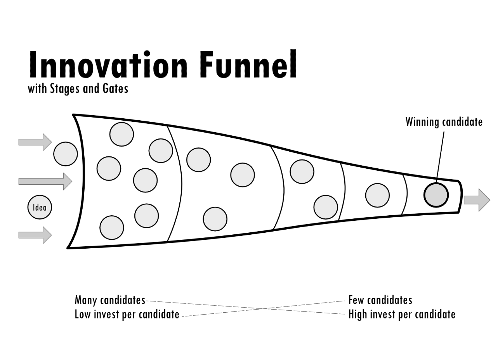

Visualisierung Ihres Funnels im Board

Mit dem *BOGI* Board halten Sie Zwischenstände fest und arbeiten mit
neuen sowie bereits existierenden Ideen. Durch das Board generieren Sie
implizit eine fließende Dokumentation ihrer Ideation- /
Innovationsvorgänge.

Für das Board eignet sich entweder ein großes Poster mit Post-It®'s der
Ideen oder eine digitale Umsetzung, z.B. basierend auf einem
Trello-Board. Für die Dokumentation ist der Übertrag dessen, was in der
Session auf Papier bewegt und hinzugefügt wurde, in jedem Falle zu
empfehlen (vor allem für die asynchrone und ortsübergreifende Einsicht),
denn Papier wird früher oder später unhandlich. Ein Tool hat echte
Vorzüge, trotz der Liebe vieler Unternehmen zu den kleinen, bunten
Zetteln auf riesigen DIN-A0 Untergründen.

Das Poster bzw. das Board soll die Etappen Ihres Ideen*battles* im
*BOGI* entlang eines Trichters (~ *Innovation Funnel*) veranschaulichen
und ist daher in Spalten (von links nach rechts) untergliedert. Links
ist der Eingang **Stage-1 für alle neu aufgenommenen Ideen**. Rechts
daneben folgen die **weiteren Spalten für die Qualifikation und
Nachbearbeitung**. Drei Spalten reichen grundsätzlich vollkommen aus, in
denen die essenziellen Schritte **Eingang, Qualifikation** und
**Auswahl** abgebildet werden, wie in dem folgenden Schema dargestellt
ist. Manche Teams nutzen aber auch gerne mehr Spalten für diffizilere
Schritte, spätere Follow-Up Phasen oder Archive.

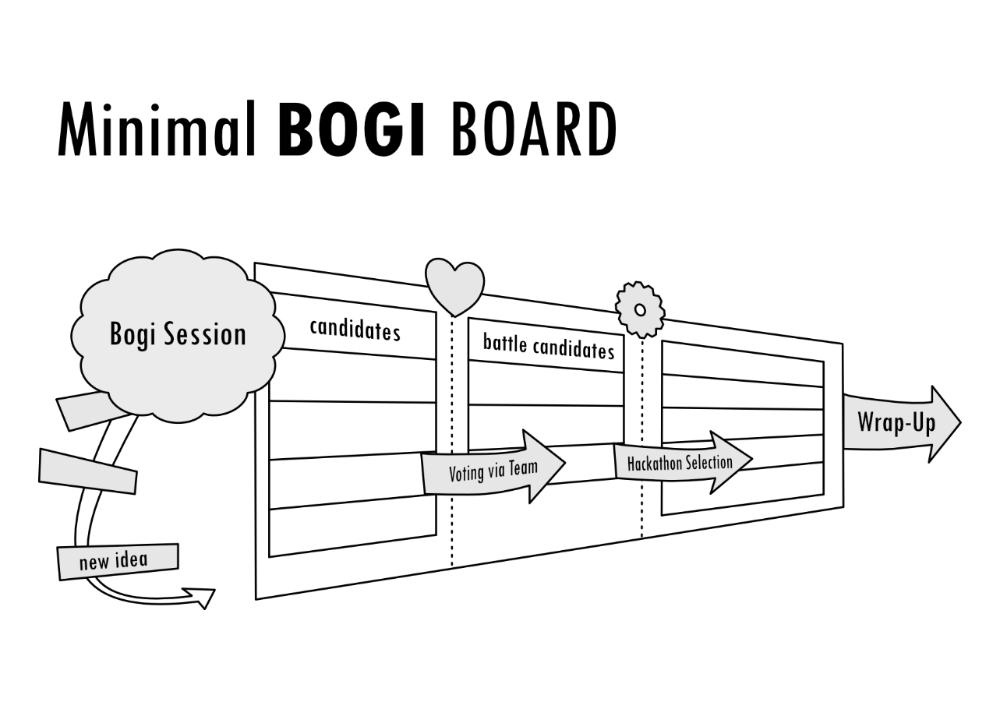

Schema eines minimalen *BOGI* Boards (Stage-1 bis 3)

Die linke Spalte **Stage-1** ist der Eingangsbereich (~ *Funnel Entry*)
für vorgestellte und durch die Gruppe angenommene Ideen. Die dort
dokumentierten **Kandidaten** haben nach der ersten Präsentation
mindestens 50% der Stimmen erhalten.

Alternative: Je nach Arbeitsweise kann es Sinn machen, wenn Sie in einer
linken Spalte vor der Stage-1 Ideen in Vorbereitung in einer separaten
Spalte parken. Die dortigen Ideen sind dann noch nicht vorgestellt oder
angenommen, könnten aber bei der Vorbereitung der *Battle Sessions*
dienen. Diese Spalte kann als **Vorbereitungsspalte Stage-0** benannt
werden.

Die Spalte nach dem Eingang ist **Stage-2** und wird die **Battle
Candidates** wiedergeben. Dort findet man solche Ideen, die sich bereits
aufgrund der Abstimmung qualifizieren konnten (die Abstimmung wird
später noch im Kontext der *BOGI* SESSION erläutert) und deshalb eine
Spalte weiter (in die Spalte Stage-2) gezogen wurden. Die *Battle
Candidates* haben in einer ersten kleinen Auseinandersetzung ihr
Potential behauptet und könnten zeigen, was in ihnen steckt. Jeder
dieser Kandidaten meisterte somit die Schnellbewertung durch eine Gruppe
und konnte sich als eine der zwei besten Ideen einer Sitzung behaupten.

Die dritte und kritischste Etappe, die es für einen Kandidaten zu
bestehen gilt, ist der ***BOGI* HACKATHON**. Der Hackathon ist die
bitterernste Entscheidungshürde im *BOGI*-Lebenszyklus. Hier trennt sich
abermals die Spreu vom Weizen. Zufällig aufgestellte Hackathon-Gruppen
müssen dafür ihr Interesse am Kandidaten offen bekunden und diesen für
die Umsetzung wählen - anders kann sich ein *Battle Candidate* nicht
weiter qualifizieren. Damit eine Idee entsprechend bearbeitet wird, muss
sie zusätzliche oder andere Merkmale aufweisen, als es für ein rein
theoretisches Voting (in der Qualifikationsrunde zuvor) nötig wäre.

Ideen, die den gesamten Funnel meistern können und den Hackathon somit
überstanden haben, können in eine letzte **Hall-of-Fame** Spalte
(**Stage-3**) im *BOGI* Board verschoben werden. Hier befinden sich alle
jemals prototypisch erarbeiteten Ideen (es sei denn, das Board wurde
aufgeräumt).

Damit repräsentieren Stage-1, Stage-2 und Stage-3 **Etappen**, denen
jeweils eine **Hürde** bzw. ein Gate (Votierung für Aufnahme, weitere
Qualifikation durch eine andere Gruppe, Auswahl zum Hackathon)
vorausging.

Alle im Hackathon erstellten Lösungen werden ferner separat
aufgearbeitet und in der Organisation oder an Stakeholder kommuniziert.
Hierfür könnte man theoretisch zusätzliche Spalten vorsehen. Letztlich
würden also durch Stage-3 erst solche Kandidaten entstehen, die sich
dann im Weiteren unter realen Bedingungen testen lassen, z.B. anhand
eines Prototyps oder Hochglanzprospekts. Wie Sie Folgeschritte gestalten
oder ob Sie diese ebenfalls im Board aufnehmen, bleibt an dieser Stelle
offen für Ihre Gestaltung.

## Veranstaltungen im *BOGI*

Der *Battle Of Glorious Ideas* ist als kontinuierliches Instrument
konzipiert. Nur so können nachhaltige Effekte erzielt werden und es ist
möglich, immer wieder auf Veränderungen oder neuen Input reagieren zu
können. Somit bleibt auch der Blick gegenüber interessanten
Möglichkeiten offen. Für die stete Bearbeitung und Bewertung von
Innovationskandidaten werden bestimmte Veranstaltungen im *BOGI*
definiert. Dabei soll mit dem *BOGI* nicht die Anzahl der Meetings in
Ihrer Organisation erhöht werden. Die Arbeit und Kreativität des
Einzelnen ist besonders wichtig, doch ein minimales Set an
Gruppenveranstaltungen ist jedoch erforderlich, um einen Rahmen für den
notwendigen Austausch in Teams bzw. Arbeitsgruppen mit bestimmten
Zielsetzungen herzustellen. Man darf die Sitzungen also nicht als freies
Brainstorming oder Strategieworkshop verstehen, in denen man im
schlimmsten Falle unverbindlich plauscht und Kaffee trinkt.

Die minimal notwendigen Events sind als **Sequenz** gedacht und bestehen
aus einer bestimmten Anzahl wöchentlicher *BOGI* SESSIONS und dem
HACKATHON. Je nach Zielsetzung der Organisation und Dynamik in der
Gruppe oder der Menge aller Teilnehmer kann eine Sequenz optimiert
werden. Die Länge der jeweiligen Events, die Anzahl paralleler *BOGI*
SESSIONS, die sich bei einer großen Teilnehmeranzahl anbietet, und der
durchschnittliche Output, der pro Sitzung erzeugt werden kann, spielen
hier eine entscheidende Rolle. Beginnen Sie mit einer Standardsequenz
von 8 *BOGI* SESSIONS und einem anschließenden HACKATHON. Auf dieser
Grundlage werden Sie erste Erfahrungen machen und können dann
Feinjustierungen pro Iteration (~ Sequenzdurchlauf) vornehmen. Letztlich
muss auch hierbei wieder das nötige Zeitbudget geklärt werden, falls
Kollisionen bzgl. anderer Prioritäten zu erwarten wären.

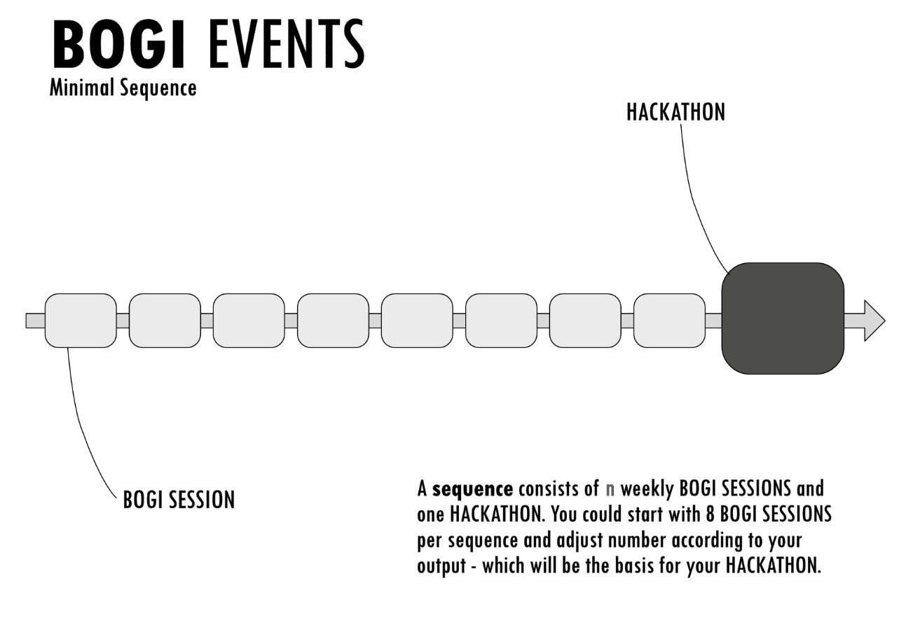

### *BOGI* SESSION (~ the weekly arena)

In einer *BOGI* SESSION können regelmäßig, vorgeschlagen ist hier auf
wöchentlicher Basis, Ideen in der Arbeitsgruppe vorgestellt, kurz
diskutiert, abgewogen und schließlich aufgenommen werden.

Diese regelmäßige „Arena“ bildet also den Ort, an dem neue Ideen dem
*BOGI* hinzugefügt, abgelehnt oder für weitere Schritte ausgewählt
werden. Die *BOGI* SESSION ist eine Art kontinuierliches Forum, durch
welches der Alltagstakt für die Ideenfindung und Selektion gestaltet
wird.

Eine einzelne *BOGI* SESSION dauert **60-90 Minuten** (so der
Vorschlag).

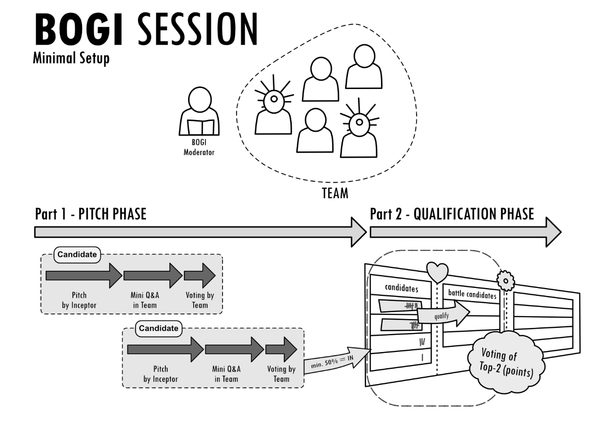

Der grobe **Ablauf einer Sitzung** besteht aus zwei Teilen:

-   **Teil 1 - PITCH PHASE:** grob 2/3 der Zeit (z.B. 40 von 60 / 60 von
    90 Minuten) wird für die **Präsentation** frischer Ideen eingeplant,
    die dann ein Kandidat für den *Battle Of Glorious Ideas* werden
    könnten.

-   **Teil 2** **– QUALIFICATION PHASE:** grob 1/3 der Zeit (z.B. 20 von
    60 / 30 von 90 Minuten) wird für die **Auswahl der zwei besten
    Kandidaten** für die nächsten Etappen vorgesehen.

Als **Besetzung** einer Session benötigen Sie einen ***BOGI* MODERATOR**
(je Gruppe, falls mehrere Sessions parallel stattfinden) und
**mindestens** **fünf Teilnehmer**.

Erfahrungsgemäß hat nicht jeder Teilnehmer eine Idee im Vorfeld
ausgearbeitet, aus diesem Grunde können Sie in der Regel problemlos in
Gruppen von bis zu 20 Personen arbeiten. Bei größeren Gruppen muss der
Moderator jedoch stärker auf die Einhaltung der Zeiten (z.B. die Dauer
pro Ideenvorstellung) und die Fairness im Sinne aller Teilnehmer (wer
war schon oft an der Reihe, wer noch nie?) achten. Es ist also ein Mix
aus Organisations- und sensibler Moderationsfähigkeit gefragt, um den
Ablauf gut zu orchestrieren. Auf der anderen Seite sollte der Moderator
aber auch nicht stören, damit eine echte Dynamik im Team entstehen kann.

Für die *BOGI* SESSION sollten Sie sich in Abhängigkeit Ihrer
Organisation Gedanken zu geeigneten **Gruppengrößen** machen. Bei großen
Teams empfiehlt es sich, mehrere Gruppen zu bilden, die parallel oder
zeitversetzt arbeiten. Beginnen Sie am besten mit einer einfachen
Regelung und optimieren Sie je Sequenz die zeitlichen Abläufe.
Beispielsweise ist es möglich, alternative Termine an unterschiedlichen
Wochentagen anzubieten, so dass sich Teilnehmer selbst zuordnen können.

Problematischer als große Teams sind besonders kleine Gruppen. Denn es
kann vorkommen, dass bei kleinen Besetzungen die Dynamik oder
Beteiligung ausbleibt. Auch Abstimmungen machen dann weniger Sinn bzw.
sind weniger aussagekräftig. In Fällen zu geringer Beteiligung sollten
Sie also eine Session ruhig abbrechen oder verschieben. Wenn generell
wenige Personen als Teilnehmer in Frage kämen (z.B. weil Ihre
Organisation insgesamt so klein ist), dann sollten Sie das Format der
*BOGI* Session so anpassen, dass es z.B. durch ein tägliches Stand-Up
Meeting à 15 Minuten ersetzt wird, in dem neue Ideen mitgebracht werden
können und gemeinsam diskutiert werden. Eine Selektion kann so unter
wenigen Personen auf Basis von Argumenten in einer längeren Diskussion
stattfinden, ohne dass das typische Voting-Verfahren angewandt wird.

Jede *BOGI* SESSION sollte im Nachgang schlank (z.B. in Form eines
Logbucheintrags) protokolliert werden, das beispielsweise öffentlich
über einen Slack Channel „\#BOGI\_log“ ungesetzt werden kann. Jeder aus
der Organisation kann dann selbst entscheiden, ob und wie viel sie / er
nachverfolgen möchte, was zuletzt im *BOGI* passiert ist. Wenn Sie einen
Service wie Slack nutzen, dann könnten Sie auch einen Bot für
SESSION-Erinnerungen, Protokolle oder Integration mit einem Trello Board
(welches Ihr *BOGI* Board wiedergibt) vorsehen. Dies bietet eine
interessante Möglichkeit, damit die Personen in Ihrer Organisation
Bewegungen am *BOGI* Board mitverfolgen oder interaktiv oder remote
teilnehmen können. Es empfiehlt sich völlig unabhängig von technischen
Tools, spielerisch zu experimentieren, wie Sie das Format *BOGI* Session
weiter zum interessanten und partizipatorischen Gruppensport ausbauen
können, der den Einzelnen inspiriert und zum Mitmachen animiert.

Die *BOGI* SESSION ist dazu da, Ideen einzusammeln und besonders Ideen
für die weitere Bearbeitung im HACKATHON herauszufiltern. Im Folgenden
wird noch etwas auf Ideen im *BOGI* eingegangen und schließlich werden
der erste und zweite Teil einer Sitzung detaillierter beschrieben.

#### Ein BOGI Kandidat / eine Idee

Jede vorgestellte Idee ist ein Kandidat für die Qualifikation im *BOGI.*
Derjenige, der eine Idee beisteuern möchte (~ der *BOGI* *INCEPTOR*),
sollte diese möglichst pointiert und aussagekräftig vor dem Team
präsentieren. Denn für den Vortrag einer Idee sind lediglich maximal 10
Minuten vorgesehen. Die anderen Teilnehmer, die bei der *BOGI* SESSION
anwesend sind, sollten die Idee schnell begreifen und beurteilen können.
Die künstliche Hürde der geringen Vortrags- und Diskussionszeit soll den
Fokus auf die wichtigsten Aspekte lenken. Bei der individuellen
Bearbeitung einer Idee kann sich jeder Zeit nehmen und nach Belieben in
die Tiefe gehen (insofern dies nicht mit anderen Prioritäten
kollidiert), im *BOGI* zählt aber die Kernaussage eines Kandidaten. Denn
alle Beteiligten investieren ihre Zeit und Aufmerksamkeit. Sie wollen
zudem auf mehrere Ideen blicken, keinen Monologen lauschen! Der Fokus
während der Vorstellung einer Idee sollte also prägnant auf das
Wesentliche gelenkt werden, nicht auf alle denkbaren Details,
langweilige PowerPoint Präsentationen, Machbarkeitsstudien oder
Anekdoten am Rande.

Für die Vorstellung der Idee im Team ist die Wahl der Medien oder
Vortragsmittel generell frei vom Inceptor zu definieren. Technische
Einschränkungen (Beamer, Anschlüsse etc.) sollte man dabei natürlich
beachten oder im Vorfeld klären. Wichtiger ist es, dass bei der
Präsentation einer neuen Idee zwei grundlegende Aspekte erklärt werden:

… das **WAS** und das **WARUM** hinter einer Idee.

**Was ist es, was man vorstellt und warum ist es wertvoll?**

Das WARUM ist dabei eigentlich wichtiger, das WAS bildet aber zusätzlich
den Rahmen für die frühe Veranschaulichung und skizziert den Lösungsraum
für eine Problemstellung.

Ideen sollten thematisch kompatibel für die generelle Ausrichtung Ihres
*BOGI* sein. Das bedeutet, dass der *BOGI SPONSOR* und ebenso der
Moderator dafür sorgen sollten, dass die Zielsetzungen der Initiative
verstanden wurden. Wenn Sie beispielsweise Ideen für neue, zukünftige
Geschäftsmodelle suchen, dann sollten Ideen sich auch auf diese
Zielsetzung beziehen. Regeln Sie zu Beginn, ob Sie auch andere Themen
mit dem *BOGI* bearbeiten wollen, etwa in einem separaten *BOGI* *Flow*
(einer speziellen Ausprägung des *BOGI*). *BOGI Flow* meint also an
dieser Stelle den konkreten Ablauf einer *BOGI* Initiative. Denn für
eine bestimmte Zielsetzung kann es Sinn machen, eine spezielle
Ausprägung aller *BOGI* Routinen und Abläufe zu erarbeiten. Im Kontext
einer anderen Zielsetzung ist es trotzdem problemlos möglich, eine
andere Ausprägung zu praktizieren, z.B. weil für das zweite Team kürzere
Sequenzen oder andere Abstimmungsverfahren besser funktionieren.

Einigen Sie sich ferner frühzeitig im Team auf etwaige Aspekte, die Sie
alle in einer Ideenvorstellung abgedeckt sehen möchten. Doch eine hohe
Formalisierung wird hier nicht empfohlen. Freiheitsgrade sind besser und
lassen dem Einzelnen mehr Optionen für einen authentischen Beitrag.

Um Ideen aber einfacher für die Verarbeitung vorzubereiten, können
simple Grundaspekte helfen. Z.B. kann man jeder Idee / jedem Kandidaten
einen prägnanten Codenamen verpassen (an den man sich gut erinnern kann)
oder vielleicht auch einen sinnvollen Untertitel um den Inhalt
anzuteasern. Es liegt letztlich bei Ihnen, was Sie zur Grundlage einer
Vorstellung und Schnellbewertung im Team machen. Aber bedenken Sie -
weniger ist manchmal mehr! Auch diese Grundlage können Sie wie viele
andere Dinge im *BOGI* später immer weiter anpassen, solange es den Flow
im Team nicht stört.

Ein **Beispiel** für eine Idee:

-   **Titel**: Suburbane Logistikhubs

-   **Ziele**: Dörfer und Gemeinden können stationäre Mini-Automaten
    betreiben, die von Handel auf Kontingentbasis genutzt (angemietet)
    werden können, um Warensample auszustellen. Bestellungen können dann
    direkt digital abgewickelt werden und die Ware wird sogar dorthin
    geliefert. So können optimierte Versorgungswege ermöglicht werden
    und es entstehen neue Optionen für den bedrohten stationären Handel,
    der auf große Ausstellungsflächen angewiesen ist, aber digital
    verdrängt wird. Gemeinden können so zusätzliche Einnahmen über
    Vermietung generieren oder Einfluss auf den Bedarf nehmen.
    Mobilitätszwänge werden entzerrt, so dass am Ende CO2-Erparnisse
    möglich sind und ein nachhaltigeres, relevanteres Konzept
    erschlossen werden kann.

-   **Präsentation**: freier Vortrag mit 1-2 Skizzen auf dem Whiteboard

Die **Präsentation** und Aufnahme / Ablehnung eines solchen Kandidaten
findet in **Teil 1 der *BOGI* SESSION** statt.

#### Teil 1: Pitch Phase

Ideen, die das Publikum durch eine aussagekräftige Präsentation
hinsichtlich des WAS und WARUM überzeugen konnten, werden vom Team
wohlwollend aufgenommen und sind damit offizielle *BOGI* Kandidaten.

Jede Idee kann dafür, wie bereits angedeutet, innerhalb von **5-10
Minuten (maximal)** präsentiert werden. Danach können Rückfragen
diskutiert werden. Dafür wird eine **MINI-Q&A (Frage und Antwort)**
Phase eingeplant. Die Zeit einer Session ist insgesamt schnell vorbei,
so dass immer nur wenige Ideen vorgestellt werden können. Je
komprimierter die Besprechung einer Idee gelingt, desto mehr Ideen
können pro Sitzung betrachtet werden. Diese Balance muss die Gruppe
selbst verinnerlichen - dann läuft es in der Regel ganz gut.

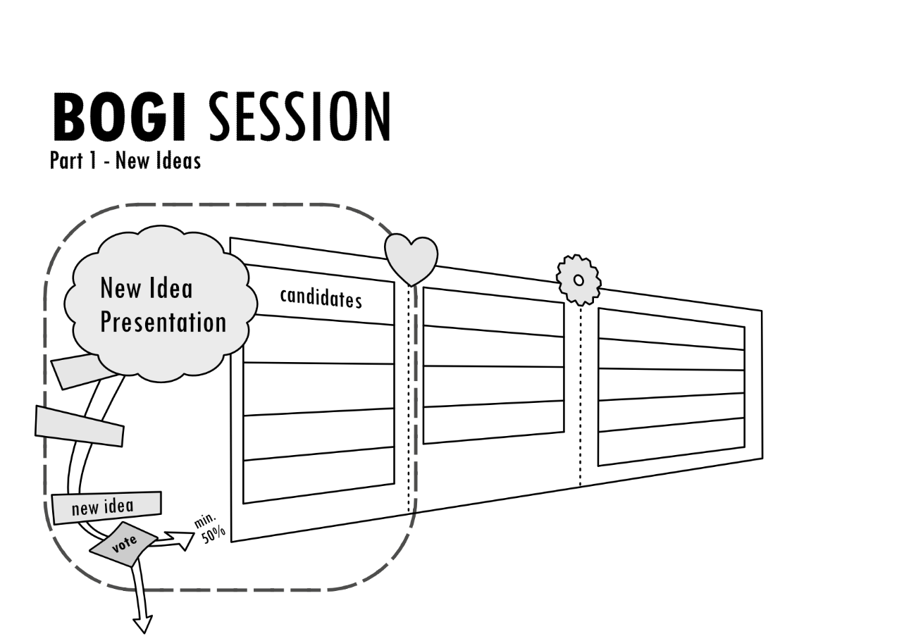

Ideen bewerten und aufnehmen

Trotzdem sollte man auch bei der Zeitkontrolle (durch den Moderator)
Wohlwollen und Augenmaß walten lassen. Seien Sie als Moderator fair,
stehlen Sie den Vortragenden nicht unnötig Zeit durch Ihr Drängeln oder
Ihre Ungeduld. Die einzelnen Personen haben sich Gedanken gemacht und
müssen sich unter Umständen überwinden, um ihre Idee vor anderen zu
präsentieren. Die abgesprochene Zeit und den nötigen Respekt hat also
jeder Vortragende verdient. Achten Sie als Moderator auch darauf, dass
möglichst verschiedene Personen die Gelegenheit erhalten, eine Idee
vorzutragen. Sich ständig vordrängelnde Personen muss man im Zweifel
etwas ignorieren, damit andere zum Zug kommen können. Seien Sie sicher:
Nicht die lautesten Personen haben die besten Ideen! Fragen Sie ruhig im
Vorfeld eventuell bei den introvertierten Personen nach, ob nicht
vielleicht eine „Weltidee“ in der Schublade liegt, die man doch noch
teilen möchte. Sie werden sich wundern …

Das Team stimmt nach jedem Ideen-Vortrag unmittelbar über die **Aufnahme
in das *BOGI* BOARD (Stage-1)** ab. Als effizientes Mittel hat sich die
folgende Abstimmungsart erwiesen:

**IN = Hand hoch, OUT = Hände runter**

Sprich, nachdem eine Idee vorgestellt ist, Fragen in der Mini-Q&A
geklärt werden konnten, stimmt jeder Teilnehmende durch Handzeichen für
eine Idee oder dagegen, indem die Hände unten bleiben. Dann zählt der
Moderator die Handzeichen. Wenn eine Idee **mehr als 50 % der Stimmen
erhält**, wird sie als Kandidat für den *BOGI* aufgenommen und dem
***BOGI* BOARD** in **Stage-1** hinzugefügt.

Die Aufnahme einer Idee in das Board muss aktiv durchgeführt werden.
Dies könnte der Moderator oder ein weiterer Helfer aus dem
Teilnehmerkreis übernehmen. Eine andere Option wäre es, dass jeder
Inceptor seine Idee bereits am Vortag auf einer weiteren
Preparation-Stage-0 im *BOGI* BOARD vorbereit hat. Das hat den Vorteil,
dass man eine aufgenommene Idee dann lediglich in Stage-1 zieht, was den
organisatorischen Aufwand während der Session minimiert. Wenn man ein
Trello-Board nutzt, kann man dort entsprechend schnell arbeiten, mit
vorbereiteten Papierkärtchen geht es aber auch. Wie Sie die Mittel für
sich passend organisieren, zeigt sich in der Regel nach wenigen *BOGI*
SESSIONS.

Nachdem eine Idee aufgenommen oder abgelehnt wurde, folgt die nächste
Ideenvorstellung. Der erste Teil der *BOGI* SESSION ähnelt also ein
wenig einem Speed-Dating.

Vorlagen machen hierbei das Leben einfacher und fördern zudem eine
konsistente Arbeitsweise. Solche Vorlagen und Hilfsmittel können für
jede am *BOGI* beteiligte Rolle Sinn machen, also für den *BOGI*
INCEPTOR, abstimmende Teammitglieder und den *BOGI* MODERATOR. Der
Inceptor hält sich an eine im Team erstellte Konvention für die
Vorstellung einer Idee. Die Teilnehmer machen sich hingegen vielleicht
gerne Notizen für die Folgediskussion und Bewertung. Der Moderator
möchte vielmehr sicherstellen, dass alle wichtigen Informationen und
Ergebnisse, wie etwa Voting-Ergebnisse, für den späteren Verlauf
festgehalten werden. Es bieten sich hier also Hilfsmittel an, die den
jeweiligen Prozess unterstützen.

Ein Moderator könnte während der laufenden Sitzung etwa eine ***BOGI*
Battlecard (Moderator)** für die schnelle Protokollierung von Ideen
verwenden, z.B. in der Form:

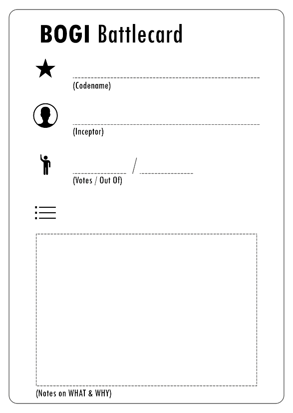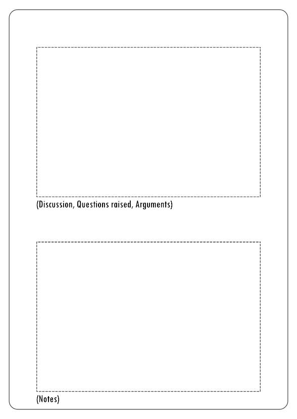

Die Teammitglieder können ebenso eine ***BOGI* Battlecard (Team)**
verwenden, um die subjektive Sicht oder Fragen für die Diskussion
schnell zu erfassen. Zur eigenen Schnellbewertung kann man sich zudem
geeignete Dimensionen bzw. eine Systematik überlegen, die dann auch für
die spätere Diskussion hilfreich sein kann.

Im Beispiel (nächste Abbildung) werden neben Notizen zusätzliche
Dimensionen verwendet: „Komplexität“, „Wartung“ (~regelmäßige Aufwände,
die anhand eines neuen Produktes, Prozesses etc. erwartet werden), „Wert
(Nutzer)“ (wie viel bringt es dem, der das Produkt oder einen Prozess
verwendet?), „Einfach zu erklären“ (nicht alle guten Ideen können
schnell vermittelt werden und sind dann in Folge doch weniger wertvoll),
„-Faktor“
(subjektives Gefallen oder empfundener WOW!-Faktor), „Machbarkeit“
(grobe Schätzung für die Realisierung).

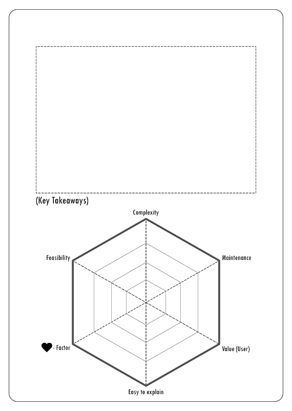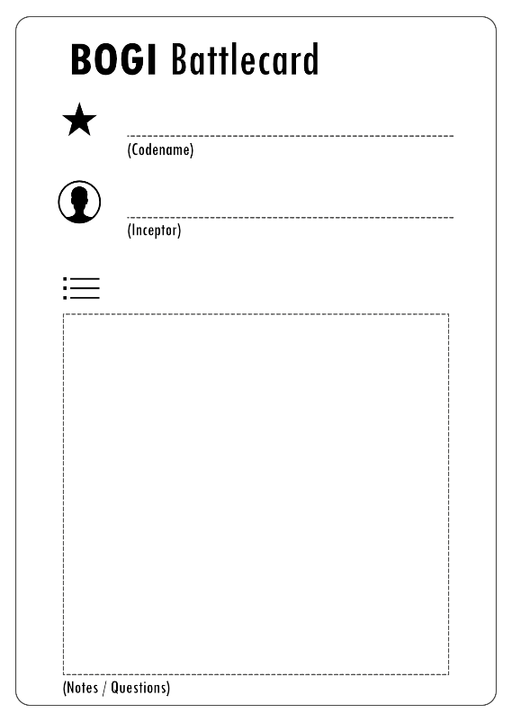

Der Vorteil solcher Karten ist, dass man sich in einer Diskussion
schneller an die wesentlichen Aspekte erinnern kann, die zu jeder Idee
notiert wurden. Spannende Ergebnisse können dann ebenso in das *BOGI*
Board übertragen werden. Bei einem systematischen Vorgehen kann man
innerhalb des Teams eine eigene „Währung“ für die qualitative
Betrachtung von Kandidaten entwickeln, z.B. was genau hohe oder geringe
Komplexität für das Team bedeutet.

Je nachdem, wofür der *BOGI* in Ihrer Organisation implementiert wird,
können maßgeschneiderte Battlecards auf die speziellen Fragestellungen
eingehen. Bei der Arbeit mit Battlecards sollte aber der praktische
Aufwand, der durch das Ausfüllen der Karten entsteht, so gering wie
möglich ausfallen. Der *BOGI* ist keine bürokratische Veranstaltung.
Damit eine *BOGI* SESSION im Fluss bleibt und unnötige Ablenkungen
ausbleiben, sollten Battlecards also nicht zu komplex aufgebaut sein.

Zusammenfassend besteht der **Ablauf jeder Ideenbesprechung** in Teil-1
der *BOGI* SESSION also aus den folgenden Schritten:

1.  Die Idee wird vom *BOGI* INCEPTOR vorgestellt.

2.  In der MINI-Q&A werden Fragen geklärt.

3.  Es erfolgt die Abstimmung, ob die Idee aufgenommen oder abgelehnt
    wird.

4.  Ideen mit mindestens 50% Zustimmung (durch Handzeichen) werden als
    Kandidaten im *BOGI* BOARD aufgenommen.

5.  Wichtige Erkenntnisse sollten in knapper Form jeweils im *BOGI*
    BOARD festgehalten werden.

Die größte Hürde bei alldem ist die Zeit! Man kann sich leicht
vorstellen, dass nicht viele Ideen pro *BOGI* SESSION (Teil 1)
betrachtet werden können. Spannende Ideen möchte man dabei eventuell
gern vertiefen, weshalb es in der Praxis schwierig ist, gehaltvolle
Diskussionen allein aufgrund einer zeitlichen Taktung zu unterbrechen.
Es ist also die richtige **Balance zwischen Qualität und Quantität**
sowie Fingerspitzengefühl gefragt, wenn es um die Optimierung der *BOGI*
SESSION geht. Die Empfehlung lautet daher: Beginnen Sie mit einem
initialen Zeitplan und prüfen Sie sukzessive, wo Sie optimieren können.
**Modifikationen und Experimente** sollte man immer wieder vornehmen,
bis ein geeigneter Rahmen für das Team gefunden ist.

#### Teil 2: Qualification Phase

Während des zweiten Teils der *BOGI* SESSION bewerten Sie die komplette
Liste **aller** bis dato angenommenen Kandidaten aus dem *BOGI* Board -
nicht allein die neu aufgenommenen Kandidaten der aktuellen Sitzung. Das
bedeutet, Sie betrachten die Menge sämtlicher **Stage-1 Kandidaten**.

Welche Kandidaten haben das Zeug zum **Battle Candidate?**

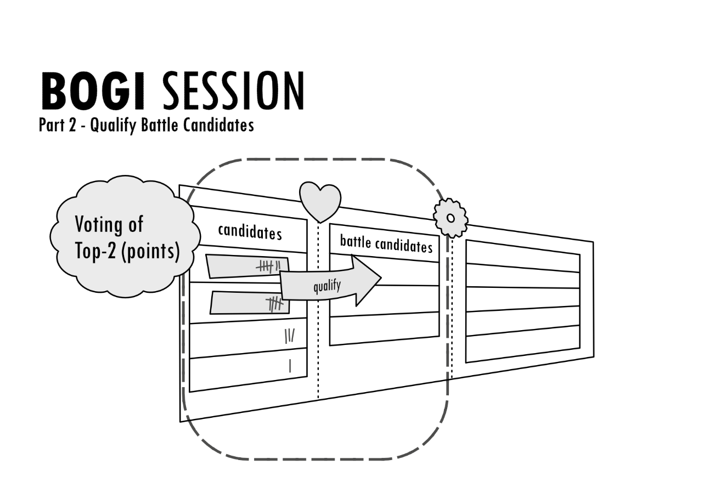

Zwei neue Battle Candidates Qualifizieren

Ziel ist es, dass Sie **pro Sitzung zwei Ideen aus Stage-1**, für die
Qualifikation der nächsten Phase des Battles isolieren.

Die Auswahl erfolgt durch alle Teilnehmer der laufenden Sitzung und
funktioniert wie folgt:

**Jeder Teilnehmer kann 3 Punkte** frei vergeben. Die Punkte können für
die subjektiv favorisierten Ideen aus der Stage-1 des *BOGI* BOARD
verwendet werden. Dabei steht es jedem Teilnehmer frei, die Punkte nach
eigenem Ermessen zu verteilen, denn es geht um die individuelle
Gewichtung. So wäre es also legitim, 3 Punkte für nur eine Idee zu
vergeben oder jeweils einen Punkt auf 3 Kandidaten zu verteilen. Es ist
so also möglich, dass die zur Verfügung stehenden Punkte verwendet
werden, um eine, zwei oder drei der großartigen Ideen individuell
hervorzuheben. Enthaltungen (~ Vergabe von 0 Punkten) kann man
prinzipiell auch erlauben, doch machen diese im *BOGI* nicht viel Sinn,
da es ja um das Selektieren der besten Ideen geht und nicht um
Enthaltungen.

Das Vorgehen ist relativ einfach. Die Punkte werden auf der Basis von
subjektiven Präferenzen, Bauchgefühl oder überzeugenden Argumenten
vergeben. Gründe und Sichtweisen könnten natürlich während der
Punktevergabe jeweils artikuliert werden, ein Muss ist dies aber nicht.
Wenn die Gruppe aus vielen Teilnehmern besteht, dann dauert es eine
Weile, bis alle Anwesenden ihre Punktevergabe argumentiert haben. Bei
kleinen Gruppen lohnt sich dieser Gedankenaustausch jedoch. Wichtig ist
es aber, dass rechtzeitig (also vor Ablauf der Session) alle Stimmen
abgegeben werden können. Für den Blick auf die Uhr ist der *BOGI*
MODERATOR zuständig. Es kann insbesondere dann zu Verzögerungen des
zweiten Teils kommen, wenn nicht alle Teilnehmer die Ideen im *BOGI*
BOARD (der gesamten Stage-1) kennen und aufgrund dessen beginnen, sich
während der laufenden Abstimmung gegenseitig die Ideen zu erklären. Das
ist ineffizient und man kann versuchen dem vorgreifen, indem vor dem
Voting alle Stage-1-Kandidaten nochmals bündig benannt und in einem Satz
erklärt werden. Bei stabilen Gruppen (die meist aus denselben
Teilnehmern bestehen) sollte dies eigentlich nicht oft nötig sein, bei
häufig wechselnden Zusammenstellungen sollte man hier jedoch eventuell
einen Vorbereitungspuffer für die individuelle Ideenrecherche im Board
voranstellen. So dass sichergestellt werden kann, dass sich Teilnehmer
bereits vor der *BOGI* SESSION einmal selbst einem Überblick über die
Stage-1 des *BOGI* BOARD verschaffen konnten und die Zeit der Session
effektiv genutzt werden kann.

Für die eigentliche Abstimmung (in der jeder drei Punkte vergibt) gibt
es verschiedene Möglichkeiten, die mal mehr, mal weniger effizient
funktionieren. Wenn man das *BOGI* BOARD als Poster verwendet und vor
sich sieht, dann könnten Post-It®’s, Aufkleber oder Striche auf Zetteln
stellvertretend für die Vergabe von Punkten herhalten. Nach der Vergabe
der Punkte würden diese bei jedem Kandidaten zusammengezählt und dann
schlussendlich die zwei „Sieger nach Punkten“ identifiziert. Also
diejenigen Ideen, für welche die meisten Stimmen zusammengekommen sind.
Bei digitalen Boards, etwa wenn ein Trello-Board für den *BOGI*
verwendet wird, muss man sich etwas einfallen lassen, so dass die
Abstimmung vergleichbar intuitiv funktioniert. Etwa, indem der Moderator
jeden Kandidaten einzeln hinsichtlich der Punktevergabe durchgeht (was
eindeutig weniger intuitiv ist und ‚mechanischer‘ wirkt). Dies hängt von
der Findigkeit im Team ab und davon, welche Medien man als Hilfsmittel
benutzt.

Das Kandidaten-Duo mit den meisten Punkten gewinnt die Runde. Beide
Ideen qualifizieren sich als **Battle Candidates**. Sollten mehr als
zwei Ideen auf den ersten beiden Plätzen (mit gleich vielen Punkten)
landen, dann muss eine schnelle Stichwahl vom Moderator durchgeführt
werden. Die neuen *Battle Candidates* aus der laufenden *BOGI* SESSION
werden dann folgerichtig in die Stage-2 des *BOGI* BOARDS verschoben.
Die Punkte aller Stage-1-Kandidaten, die durch die Abstimmung in einer
Sitzung zustande gekommen sind, müssen Sie übrigens nicht für die
Nachwelt erhalten. Denn, wie inzwischen klar sein sollte, alle
Stage-1-Kandidaten treten in jeder *BOGI* SESSION erneut in die Arena.
Alte Punkte erzeugen nur unnötigen Overhead und beeinflussen andere
Teilnehmer möglicherweise bei Ihrer Wahl.

**Eine kurze Rekapitulation:** Sie kennen jetzt die Abläufe aus Teil-1
und -2 der *BOGI* SESSION. Ideen werden schnell vorgestellt und für
Stage-1 aufgenommen oder abgelehnt. Templates und Battlecards
erleichtern hier ebenso wie prägnante Präsentationen das Vorgehen. Für
den Inceptor gilt es, das WAS und WARUM in maximal 10 Minuten
darzustellen. Alle existierenden Stage-1-Kandidaten treten schließlich
in den Ring und zwei Gewinner werden pro Runde ermittelt. Auf diese
Weise gibt die *BOGI* SESSION den Takt für Ihre Innovationsmaschine vor.
Nutzen Sie die Fertigkeiten des Moderators, um Präsentationen neuer
Ideen, Diskussionen, die Einhaltung der Zeiten und die
Abstimmungsvorgänge pro Sitzung zu erleichtern.

Für die *BOGI* SESSION gilt insgesamt, dass sie für das Team
funktionieren muss. Damit der Ablauf von *BOGI* SESSIONs gut gelingt,
sollten Details im Vorgehen und Spielregeln von der Gruppe selbst auf
Konsensbasis feinjustiert werden. In bestimmten Abständen kann man dazu
immer wieder eine Diskussion bzgl. der Feinabstimmung des Vorgehens
einplanen (etwa einmal pro Sequenz). Die *BOGI* SESSION klappt dann
optimal, wenn ein Grundkonsens für den Ablauf weitestgehend erreicht und
kontinuierlich praktiziert wird. Konzentrieren Sie sich somit auf die
Hilfsmittel und Abläufe, die für Ihr Team am besten geeignet sind.
Investieren Sie ferner in eine minimale Vor- und Nachbereitung jeder
Sitzung. Bei festen Besetzungen erzeugt dies kaum Aufwand. Bei stetig
wechselnden Teilnehmerkreisen wird es dafür umso wichtiger.

Das Wichtigste zum Schluss: Eine *BOGI* SESSION soll **Spaß** machen! In
zwanghafter oder gar langweiliger Atmosphäre gedeiht selten Glorreiches.
Eine strikte Prozesstreue ist nicht immer geeignet, um im Team an und
mit Ideen zu arbeiten. Freude und Neugier sind gute Sparringspartner –
auch im *BOGI*. Und im besonderen Maße gilt dies vielleicht für den
*BOGI* HACKATHON – dieser wird nun beleuchtet.

### *BOGI* HACKATHON

Der **HACKATHON** ist die Veranstaltung, bei der es um die prototypische
**Umsetzung oder Bearbeitung Ihrer Ideen** bzw. „um die Wurst“ geht. Es
werden, wie es sich für den *BOGI* gehört, nur die erlesensten Ideen in
dieses Schlachtfeld geführt. Das Ziel des HACKATHONs ist es, die
praktische Seite der Battle Candidates auf Herz und Nieren zu
überprüfen, indem ein Prototyp oder eine kreative Ausarbeitung für die
weitere Beurteilung einer Idee (bei Stakeholdern, Kunden etc.) erstellt
wird. Der HACKATHON ist der Höhepunkt jeder *BOGI* Sequenz und findet
damit seltener als andere Events statt, z.B. jeden zweiten Monat.

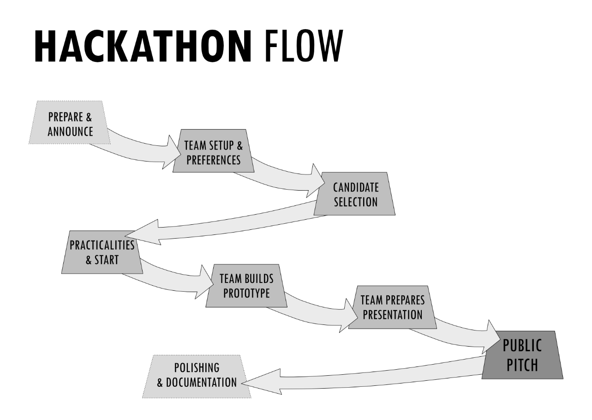

Grober Fahrplan für einen Hackathon

#### Der Ablauf des HACKATHON

1.  **PLANUNG**: Geben Sie jeweils vorab bekannt, wann ein HACKATHON
    > stattfindet und laden Sie Ihre Organisation zur Vorstellung der
    > Ergebnisse zum Ende des HACKATHONs ein. Klären Sie vorab Zeiten,
    > Agenda und wichtige Rahmenbedingungen, z.B.:

    -   Wieviel Zeit hat jedes Team für die Realisierung einer Idee?

    -   Wie und in welchem Budget werden Hilfsmittel beschafft, sollten
        diese benötigt werden?

    -   Welche logistischen Probleme können auftauchen?

    -   Wer hilft bei der Organisation im Vorfeld?

    -   Wann und wo wird das Ergebnis präsentiert?

    -   Gibt es eine Videoübertragung der Präsentation für die Personen,
        die nicht vor Ort sind?

> Der HACKATHON erfordert im Vorfeld ein gewisses Maß an Logistik, wenn
> er jedoch ein paar Mal durchgeführt wurde, geht die Vorbereitung des
> Events immer leichter und effizienter von der Hand.
> Bestimmen Sie früh genug Moderatoren und helfende Hände (*BOGI*
> GUIDEs) und bereiten Sie den Tag vor.

2.  **START**: Eröffnen Sie die Veranstaltung mit den teilnehmenden
    > Personen. Hier sind noch nicht die späteren Zuschauer anwesend,
    > sondern jeder, der Lust an der Umsetzung der Ideen hat. Diesem
    > Personenkreis sollten Sie nun eine informative und motivierende
    > Eröffnung bieten: LET THE HACKATHON BEGIN!

3.  **GRUPPENBILDUNG und -IDENTITÄT**: Bilden Sie in einem ersten
    > organisatorischen Schritt Gruppen angemessener Größe (z.B. mit
    > jeweils 5 Personen pro Gruppe). Achten Sie hierbei auch auf die
    > Gesamtzahl aller Teilnehmenden und legen Sie daraufhin die
    > Gruppengrößen fest. Zu viele Gruppen erschweren die Organisation,
    > die Balance macht’s also. Stellen Sie die Teilnehmer der Gruppe
    > zufällig zusammen, so dass immer wieder neue Konstellationen neue
    > Aufgaben lösen müssen bzw. nicht immer wieder die gleichen
    > Sitznachbarn eine Gruppe bilden. Jede Gruppe sollte sich dann kurz
    > finden und einen epischen Gruppennamen wählen, mit dem sie im
    > HACKATHON antritt.

4.  **FESTLEGUNG VON PRÄFERENZEN**: Jede Gruppe diskutiert nun anhand
    > des *BOGI* BOARDS Präferenzen bzgl. der wählbaren ***Battle
    > Candidates***. D.h. alle Ideen aus Stage-2 können hier theoretisch
    > ausgewählt werden. Dies dient der ersten Orientierung und
    > beschleunigt später den Ablauf. Lassen Sie die Gruppen dafür 10-15
    > Minuten lang die Kandidatenauswahl diskutieren. Um Kollisionen mit
    > der Auswahl anderer Gruppen zu vermeiden, sollten bestenfalls drei
    > Kandidaten (A, B, C) je Gruppe ausgesucht werden. A = Das ist das,
    > was die Gruppe möchte … B = Der Fallback, wenn A nicht mehr
    > möglich ist … C = Der Fallback, wenn A und B nicht mehr möglich
    > sind. Was ist zu beachten?

    -   Es ist nur erlaubt, <u>einen</u> der bestehenden *Battle
        Candidates* im HACKATHON zu bearbeiten.

    -   Jedes Team des HACKATHONs wählt nach eigenem Ermessen. Denn die
        Gruppen des HACKATHONs stellen das endgültige GATE für jede Idee
        dar! Jedes HACKATHON - Team repräsentiert eine jeweils
        einzigartige Konstellation von Persönlichkeiten (inkl. aller
        Fähigkeiten, Vorlieben und Erfahrungen). Diese einzigartige
        Konstellation ist die besondere Hürde für den Battle Candidate.

5.  **KANDIDATEN**-**WAHL**: Bestimmen Sie nun, welche Gruppe zuerst den
    Kandidaten wählen darf, z.B. im Losverfahren oder durch den
    Moderator. Jede Gruppe wählt nun (auf Grundlage der zuvor
    festgelegten Präferenzen A - C) ihren Kandidaten für die Umsetzung.
    Die erste Gruppe kann also aus dem Vollen schöpfen, Folgegruppen
    müssen vielleicht auf Präferenz B oder C ausweichen, wenn ihnen
    andere Gruppen zuvor gekommen sind.

6.  **BRIEFING**: Klären Sie den Zeitplan erneut, was die Umsetzung und
    Deadlines betrifft. Klären Sie, wann die Umsetzungsphase abgelaufen
    ist, wann die Präsentation der Ergebnisse beginnt und dass jede
    Gruppe etwas Vorbereitung für die Vorstellung einplanen sollte.
    Wiederholen Sie die für die Umsetzung wichtigen organisatorischen
    Aspekte. Klären Sie darüber auf, welche Räume für welche Gruppen
    bereitstehen und an wen man sich im Falle von Schwierigkeiten oder
    Fragen wenden kann (*BOGI* GUIDEs). Stellen Sie spätestens jetzt
    sicher, dass es hinreichende Unterstützung für die Gruppen gibt. Die
    Unterstützer sollten für den reibungslosen Ablauf der Veranstaltung
    sorgen und gerade zu Beginn und gegen Ende der Bearbeitungszeit
    aktiv das Geschehen beobachten.

7.  **REALISIERUNG**: Die Gruppen beginnen anschließend mit der
    Realisierung ihres Kandidaten. Hierfür muss vermutlich zu Beginn
    eine Lösungsstrategie erarbeitet werden; es tauchen eventuell die
    ersten kritischen Fragen auf. Die *BOGI* GUIDEs sollten gerade in
    der ersten Zeit nach dem Startschuss darauf achten, ob die Gruppen
    Hilfe benötigen. Zur Realisierungsphase gehört auch, dass die Gruppe
    ihre Vorstellung vorbereitet. In der Teamdiskussion sollte das
    bedacht werden.

8.  **PRÄSENTATION**: Schließlich findet die gebührende Präsentation der
    Ergebnisse vor dem geladenen Publikum statt. <u>Jedes</u> Ergebnis
    ist hier wichtig, jede Lösung gilt, insbesondere auch gescheiterte
    Umsetzungen! Von den Teamerfahrungen kann man viel über die Ideen
    lernen, insofern gibt es kein Scheitern, sondern lediglich
    erfolgreiche Experimente! Jede Gruppe stellt nacheinander knapp die
    wichtigen Ergebnisse, Überlegungen und Erkenntnisse vor (gerne auch
    unterhaltsam). Ziel ist es, die gewonnenen Erfahrungen auf Basis der
    praktischen Arbeit mit dem Publikum zu teilen. Man sollte klären,
    wie viel Zeit jeder Gruppe maximal für die Vorstellung ihrer Lösung
    zur Verfügung steht (z.B. 15-20 min.). Zudem hilft es, wenn
    frühzeitig im Team geklärt werden konnte, wer die jeweilige
    Gruppenpräsentation durchführt. Die Präsentationsrunde zum Schluss
    sollte allen Beteiligten Spaß machen und sollte daher nicht
    bierernst oder zu formal durchgeführt werden.

9.  **AUFARBEITUNG (NACH DEM HACKATHON)**: In einem letzten Schritt geht
    es um die Rekapitulation der gewonnenen Erkenntnisse und die
    kommunikative Aufarbeitung jeder Umsetzung (in Form eines Videos,
    One-Pagers, einer Demo etc.). Um den Wert der Ergebnisse und der
    zugrundeliegenden Ideen zu evaluieren, sollten schlichtweg alle
    HACKATHON-Resultate für die weitere Erprobung (und als Dankeschön an
    die Teams) aufpoliert werden. Man könnte beispielsweise für den
    Prototypen einer Produktidee eine Mini-Kampagne oder Broschüre
    erstellen, die so oder ähnlich auch an reale Kunden herangetragen
    werden könnte. Ideen, die z.B. ein Verfahren oder einen Prozess
    beschreiben, könnten auch nochmal prägnant visualisiert und
    Mehrwerte unterstrichen werden. Letztlich geht es in diesem Schritt
    darum, die wesentlichen Eigenschaften und Werte zu pointieren und
    für eine Kommunikation an Dritte aufzubereiten. Daneben können neue
    Erkenntnisse auf Basis des HACKATHON zielgerichtet dokumentiert
    werden, etwa neue Informationen zur Machbarkeit oder erfolgreiche
    Lösungsstrategien. Alle relevanten Ergebnisse sollten für die
    Organisation zugänglich bereitgestellt und aktiv kommuniziert
    werden, so dass wirklich gute Ideen nicht in einer Schublade
    verstauben. Je lebendiger der Umgang mit dem existierenden Ideengut
    ist, umso besser. Grandiose Ideen werden früher oder später auf
    fruchtbaren Boden fallen, solange man sie kommuniziert. Alle
    Kandidaten, die den *BOGI* HACKATHON überstanden haben, sollten in
    einer *Hall-Of-Fame* gebührend als epische Idee dokumentiert werden.
    Im *BOGI* BOARD kann dies dann ebenso über eine Stage-3 geschehen.

#### Was sollten Sie beachten?

Für einen HACKATHON in Ihrer Organisation sollten Sie verschiedene
Punkte beachten, damit die Durchführung optimal funktionieren kann.

-   **Wählen Sie ein passendes Zeitformat:** Der *BOGI* empfiehlt an
    dieser Stelle einen Fahrplan bzw. den Ablauf eines HACKATHON. Der
    optimale Zeitrahmen für diese Veranstaltung kann jedoch an dieser
    Stelle nicht für alle Organisationen und Teams allgemeingültig
    beschrieben werden. Die Art der Ideen determiniert, ob eine
    prototypische Umsetzung einfach oder schwierig möglich wäre. Zudem
    spielt die Teamgröße, die Örtlichkeit und vieles andere stark in die
    Planung des Formats mit ein. Es kann also sein, dass der HACKATHON
    nicht ein 1-Tages-Event ist, sondern sich eher als 5-Tages-Event
    eignet. Oder, dass für ein Open-Source-Projekt besser geeignet wäre,
    Prototypen gänzlich in einem anderen Format anstelle des HACKATHONS
    umzusetzen. Hier ist Ihre Einschätzung die jeweils richtige. Der
    *BOGI* HACKATHON ist als Platzhalter dafür zu verstehen, dass Ihren
    Ideen eine Gestalt verliehen wird, mit der man die Idee im
    Wesentlichen sichtbar macht und auf welcher Basis dann Feedback
    eingeholt werden kann. Ein Event wäre deshalb zu bevorzugen, weil
    dies den Aktionscharakter dieser Phase besser unterstreicht und weil
    es sich für die Taktung innerhalb der Sequenzen (als Teil des
    kontinuierlichen Arbeitsflusses) gut eignet. Andere Möglichkeiten
    sollen jedoch nicht ausgeschlossen werden.

-   **Diskutieren Sie, was „Prototyp“ in Ihrem Falle bedeutet:** Im Zuge
    des HACKATHON wird eine Idee als Prototyp umgesetzt. Doch die Art
    der Idee schränkt Umsetzungsmöglichkeiten stark ein. Wenn die Idee
    eine neue Rakete ist, dann werden Sie diese nicht in wenigen Stunden
    bauen und für einen Testflug vorbereiten. Vielmehr würden Sie eine
    bestimmte Überlegung pointiert darstellen wollen, z.B. das
    Grunddesign oder die Idee, dass die Rakete autonom landen kann und
    damit wiederverwendbar ist. Wenn Ihr Thema mit Softwareentwicklung
    zu tun hat, dann kann ein Entwurf einer Architektur, eine Case-Study
    im Bereich UX oder ein klickbarer Prototyp möglich sein. Wenn Ihre
    Themen mit Prozessen zu tun haben, dann wäre es etwa eine
    detaillierte Ausarbeitung und Visualisierung eines Vorschlags.
    Geschäftsideen könnten als Business Case im HACKATHON erstmalig
    betrachtet werden oder im *Business Model Canvas* skizziert werden.
    Wenn Ihr Thema Content ist, dann kann eine neue Content Strategie
    skizziert werden. Wenn Sie CO2-Emissionen reduzieren wollen, dann
    könnten hier Einsparungspotentiale analysiert werden oder eine
    Methode konzipiert werden, die zur Einsparung führt. Vieles ist ja
    möglich, aber letztlich dreht sich alles um den spezifischen Kontext
    Ihrer Organisation! Setzen Sie also in einer grundsätzlichen
    Betrachtung einen sinnhaften Rahmen, der für Ihren Kontext besonders
    relevant ist. Überlegen Sie, was Sie im Team anhand von praktischen
    Experimenten herausfinden möchten. So kann auch das spezifische
    Format Ihres HACKATHON sinnvoll feinjustiert werden.

-   **Ein HACKATHON muss nicht in der Black-Box stattfinden:** Der
    HACKATHON erzeugt „Assets“ für Ihre weiteren Tests oder den
    allgemeinen Erkenntnisgewinn. Es ist also im Einzelfall absolut
    valide, Personen außerhalb Ihrer Organisation für solche Events
    einzuladen. Vielleicht sogar als Teilnehmer (oder vielleicht ja
    schon für den gesamten *BOGI*-Flow). Betrachten Sie einen HACKATHON
    also nicht als Pizza-Veranstaltung oder reines Belustigungsprogramm,
    sondern vielmehr als Labor und Handelsplattform von Ideen. Die
    Arbeit an Ideen vertieft sich praktisch erstmals im HACKATHON. Das
    beinhaltet Potential für viele Interaktionen, die nicht allein nur
    mit der „internen Bestandsgruppe“ Sinn machen müssen. Andere
    Personen mit anderen Hintergründen (Partner, Kunden, Kontakte aus
    dem erweiterten Netzwerk) können hier essentiellen Input liefern und
    kommen gleichzeitig mit Ihrer Hypothesenwelt in Kontakt. Das kann
    wertvoll sein, weil diese meist gar nicht von außen erkannt wird.
    Ferner ist der Beitrag von Außenstehenden meist der entscheidende,
    wenn es um die Erweiterung des Horizonts geht. Halten Sie Ihren
    *BOGI* und damit den HACKATHON also nicht unter Verschluss!

-   **DOING BY LEARNING:** Unter Garantie werden bei der Durchführung
    der ersten HACKATHONS Probleme auftreten, mit denen niemand
    gerechnet hat. Das ist im Grunde ganz gut so! Denn der HACKATHON
    spiegelt schließlich einen kleinen Ausschnitt der Realität wider.
    Öffnen Sie sich gegenüber Gründen, Neues zu lernen und verbessern
    Sie ganz einfach das Format. Nach 4-5 HACKATHON-Runden sitzt es dann
    schon ganz gut und das Erlernte erzeugt vermutlich ganz nebenbei
    positive Effekte für den sonstigen Alltag.

-   **WENN DER HACKATHON EINFACH SO GAR NICHT PASST:** Es kann unter
    Umständen aber auch sein, dass der HACKATHON für Ihre Organisation
    so gar nicht klappen möchte, Ihr Thema oder andere Umstände einfach
    nicht ins Bild passen. Nun, dann lassen Sie ihn weg! Aber prüfen
    Sie, warum eine nähere Betrachtung der praktischen oder
    konzeptuellen Ebene nicht ins spezifische Bild passen sollte. Wenn
    der HACKATHON nach dieser Überlegung immer noch nicht ins Bild
    passt, dann überlegen Sie, ob Sie eine geeignete Hürde (im Sinne
    eines Selektionsmechanismus) anstelle des HACKATHON für Ihren *BOGI*
    konzipieren können. Das kann ein Stakeholder-Review sein oder etwas,
    das kompatibel in Ihrem Sinne ist. Aus den Teams heraus sollten die
    Ideen die Realität erobern. Wie dies prinzipiell für Ihren Fall am
    besten gelingt, ist *BOGI Customizing*. Anpassungen des BOGI sind
    kein Manko, sondern Optimierung. Zum Glück ist der *BOGI* keine
    Religion!

### *BOGI* Hygiene

Hygiene ist wichtig, auch im *BOGI*. Von Zeit zu Zeit sollten Sie
deshalb unbedingt eine Hygienesitzung einplanen. Z.B. jeden zweiten
Monat als separate Veranstaltung mit ein paar Teilnehmern oder als
Ersatz einer regulären *BOGI* SESSION.

**Was ist mit Hygiene gemeint?**

Hygiene bedeutet hier, dass durch gezielte Pflegeaktionen die Qualität
und Relevanz von Ideen und dem *BOGI* BOARD sichergestellt wird.

Eine Hygienesitzung ist somit eine fast administrative Aktion, in der
das Board bereinigt oder aufgeräumt wird. Zuweilen bedarf dies auch der
inhaltlichen Diskussion von Kandidaten und dem Review der Stages. Sie
machen dann beispielsweise die Kandidaten ausfindig, die inzwischen
wirklich mal bereinigt werden sollten, damit der Innovationstrichter im
*BOGI* BOARD nicht zur Halde netter Einfälle verkommt oder schlichtweg
„verstopft“. Nötig wird es dann, wenn man mit einer Gruppe zügig viele
Ideen sammeln, aber nicht annähernd viele Ideen durch den HACKATHON
realisieren kann. In diesem Fall sollte man die Messlatte tatsächlich
höher ansetzen und alte Ideen, die es seit Monaten nicht zum *Battle
Candidate* brachten, einfach löschen. **Wenn Kandidaten Staub ansetzen,
sind sie einfach nicht gut genug für den *BOGI*!** Sie stören dafür
ungemein in jeder *BOGI* SESSION, solange sie erhalten bleiben. Denn
auch angestaubte Kandidaten müssen immer wieder von jedem Teilnehmer neu
betrachtet werden – das kostet Nerven und Lebenszeit. Doch vor allem der
unverstellte Blick hilft bei der Suche nach glorreichen Ideen. Es ist
zudem unwahrscheinlich, dass Ideen, die sich über Monate hinweg nicht
weiter qualifizieren konnten, plötzlich einen unerwarteten Aufwärtstrend
erfahren. Lüften Sie also guten Gewissens ab und an das *BOGI* BOARD und
seien Sie durchaus ungnädig gegenüber den altbekannten Dauer-Kandidaten.
Wenn Sie eine Idee archivieren oder löschen, sollten Sie dann aber unter
Umständen den Initiator der entsprechenden Idee informieren, um nett auf
deren Löschung hinzuweisen. Wenn das die gängige Praxis ist, wird sich
hoffentlich niemand persönlich angegriffen fühlen.

Tipp: Wenn Sie ein Board z.B. mit Trello pflegen, dann könnten Sie über
eine geeignete Erweiterung das Alter der Kandidaten visualisieren. Diese
optische Hilfestellung erleichtert die Pflege ungemein.

Schauen Sie Ihr *BOGI* BOARD hin und wieder auch auf Basis einer
**„Funnel-Logik“** an. Reflektieren Sie dabei die Verhältnismäßigkeiten
der Stages (hinsichtlich der Kandidatenmengen je Stage) zueinander.
Beispiel: Wenn mehr als 99 Ideen in Ihrer Eingangsstufe (Stage-1)
liegen, aber nur 5 *Battle Candidates* (in Stage-2), dann ist Ihr
BOGI-Motor nicht sauber getaktet oder auf die Gruppengrößen etc.
abgestimmt. Man sollte dann prüfen, wie es zu solchen Schieflagen kommen
kann und wie der Durchsatz über die verschiedenen Phasen hinweg besser
austariert werden kann.

Zur Erinnerung, wann wie viele Kandidaten pro Stage zustande kommen: Die
Anzahl der Kandidaten in Stage-1 resultiert aus allen vom Team
angenommenen Ideen, die zuvor jeweils vorgestellt wurden, abzüglich der
Ideen, die sich weiter pro Sitzung für Stage-2 als Battle Candidates
qualifizieren. Es sollten pro *BOGI* SESSION nur zwei Kandidaten Stage-2
erreichen. Stage-2 ist dann weiter der Fundus der Ideen, die im
HACKATHON bearbeitet werden können. Je nachdem wie häufig und
teilnehmerstark ein HACKATHON durchgeführt wird, ergeben sich
unterschiedlich viele Realisierungen. Realisierte Ideen wandern von
Stage-2 in Stage-3. Die Konversionslogik regulieren Sie also über die
Nachjustierung der Kriterien oder Häufigkeiten von bestimmten Aktionen.

Jeder weiß vermutlich intuitiv, wie eine solide gefüllte Pipeline in
einer Trichteranalogie (in diesem Falle Ihr *BOGI* Innovation-Funnel)
aussieht – am Eingang (Stage-1) sollten viele Kandidaten existieren und
am Ausgang (Stage-3) realistisch wenige, dafür aber sehr gute. In der
Mitte des Funnels (also Stage-2) kann in Hinblick auf die Mechanik von
Zu- und Abgängen ebenso nachjustiert werden, sollten die Verhältnisse
gar nicht sinnvoll zueinander passen. Wichtig ist aber, dass die
Wahrscheinlichkeit steigt, dass es sich in der „Mitte“ im bessere Ideen
handelt.

Man muss in diesem Kontext zusätzlich anmerken, um falsche Deutungen
bezüglich der Trichterlogik zu vermeiden: Die Anzahl der Kandidaten je
Stage kann ein verzerrtes Bild erzeugen und spiegelt einen optimalen
Funnel nicht immer sauber wider. Denn die Mechanik pro Stage ist
abweichend. Stage-3 leert sich etwa nicht (durch Verschiebungen),
wodurch diese Stage als „Hall-of-Fame“ alles kumuliert, was jemals dort
ankommt. Die Bereinigung wird ja vor allem für Kandidaten in Stage-1
oder vielleicht Stage-2 als relevant erachtet, um dort Kandidaten ohne
Potential auszufiltern. Zudem ergeben sich durch die Qualifikationen
automatisch Abhänge in Stage-1 und -2. Dadurch fluktuiert die
Listenlänge in Stage-1 und -2, aber Stage-3 wird scheinbar immer länger.
Behalten Sie diese Effekte bei der Analyse und Hygiene im Hinterkopf.

Doch wie kann man nun die Verhältnisse zwischen den Stages oder genauer
den **Flow im Innovation Funnel optimieren**?

-   **Optimieren Sie die Übergänge zwischen den Stages:** Indem die
    Anzahl der Kandidaten je Sitzung angepasst wird, die mindestens oder
    maximal pro Stage qualifiziert werden können, regeln Sie den
    Durchfluss. Wenn für den HACKATHON z.B. jeweils zu wenige *Battle
    Candidates* vorliegen, können Sie in einer *BOGI* SESSION
    zusätzliche Battle Candidates in Teil-2 der Sitzung qualifizieren.
    Also mehr als zwei, wie es hier der ursprüngliche Vorschlag ist.

-   **Hacken Sie die Sequenz:** Ähnliche Korrekturen erreichen Sie,
    indem Sie die Anzahl der der *BOGI* SESSIONs vor einem HACKATHON
    (~also in einer Sequenz) erhöhen oder verringern. Das Verhältnis von
    *BOGI* SESSIONS zu HACKATHONs ist dann besonders für die Regulierung
    geeignet, wenn konstante Teilnehmerzahlen (in allen Veranstaltungen)
    zu verzeichnen sind.

-   **Manipulieren Sie die Zeitachse:** Die Zeit pro Sitzung (also einer
    BOGI SESSION) sowie die Anzahl der jeweils teilnehmenden, aktiven
    Personen kann ebenfalls erhöht oder eingeschränkt werden. Hiermit
    können Sie grundlegende Verhältnismäßigkeiten anpassen, indem Sie
    Einfluss darauf nehmen, wie viele Ideen überhaupt aufgenommen oder
    besprochen werden könnten.

-   **Machen Sie passend, was nicht passt:** Ferner können Sie
    grundlegend härtere Kriterien einführen, was die Übergänge der
    Stages betrifft. Sie könnten auch eine ganz neue Stage einführen,
    z.B. eine, die einen weiteren „Veredelungsschritt“ eines Kandidaten
    nach Stage-2 als Voraussetzung vorsieht, so dass nur ausgewählte
    oder entsprechend aufbereitete Kandidaten für den HACKATHON (aus dem
    Pool der neuen Stage) in Frage kommen.

Sie erkennen vermutlich, dass es flexible Optionen gibt, den Ideenfluss
zu regulieren. Wenn Sie Ihre Maschinerie einmal sauber eingestellt
haben, dann läuft der Motor und schnurrt hoffentlich dauerhaft wie ein
Kätzchen! Der Kontrollblick lohnt sich aber allemal, um den Durchfluss
von Kandidaten optimal zu gewährleisten und an der Teamstärke und
-dynamik auszurichten.

Zur Hygiene gehört schließlich, dass Sie bei Ihren eigenen **Standards
und Absichten** bleiben, um Kandidaten formal (!) gleichförmiger
Qualität zu generieren, die inhaltlich (!) auf die Ziele ihres *BOGI*
einzahlen. Wenn Sie bestimmte Standardkriterien für die Beschreibung von
Kandidaten definieren, dann sollten diese Standards also auch bei allen
Ideen angewandt werden. Wenn Kandidaten untereinander völlig inhomogen
beschrieben werden oder im Einzelfalle für Dritte nicht mehr
verständlich sind, sollten diese jeweils neu aufgearbeitet oder gelöscht
werden. Wenn Sie Kandidaten entdecken, die nichts mit den Zielen der
Veranstaltung zu tun haben, dann hinterfragen Sie diese einfach. Ein
Beispiel kann hier sein, dass Sie den *BOGI* praktizieren, um neue
Weiterentwicklungsideen für ein bestehendes Produkt zu isolieren. Sie
sehen dann aber eine Idee, die ein vom Produkt vollständig losgelöstes
Experiment beschreibt. Zögern Sie nicht und hinterfragen diese Idee
direkt gemeinsam mit dem Inceptor, also dem Autor der Idee. Vielleicht
haben Sie oder der Inceptor einfach etwas falsch interpretiert und der
Fall ist schnell geklärt. Das kommt vor und ist kein Drama! Doch ein
*BOGI*, der an seinen Zielsetzungen vorbeiläuft, fasert aus und wird
früher oder später irrelevant. Sinnloses wird für alle Beteiligten zur
Last - und das ist nicht die Intention! Bleiben Sie also auf Kurs oder
erstellen Sie eine weitere Parallelveranstaltung für „anderes“. Denn
gute Ideen sind wertvoll!

Dokumentieren Sie zudem die Voting-Ergebnisse oder Erkenntnisse aus den
Diskussionen bündig. Hiermit vertiefen Sie die Qualität des Boards für
Leser oder Remote-Publikum und können nachhaltig mehr Nutzen ziehen.
Hygiene hat also auch mit dem Blick für nachhaltigen Mehrwert zu tun.

# BOGI TIPPS & TRICKS

## Einladungen, Trigger und Motivation

Der *BOGI* MODERATOR (zu Beginn besser noch der *BOGI* SPONSOR) lädt die
Teilnehmergruppe jeweils für die *BOGI* SESSION ein, z.B. via E-Mail
oder Slack. Die zentralen Events sollten immer kurz in Form einer
Erinnerung angekündigt werden. Wenn diese Dinge zu aufwändig für eine
Person werden sollten, können Sie jederzeit auch zusätzliche Rollen
einführen, wenn es um die Organisation oder regelmäßige Koordination
geht. Wichtig ist, dass es geschieht.

Es ist eine größere Aufgabe, (1) den „Motor“ eines Events zum Laufen zu
bringen und (2) dann das Tempo zu halten. Denn nach dem ersten Hype
treten schnell (wie bei allem!) die ersten Verlusterscheinungen und
Trägheitssymptome ein. Das ist normal! Lassen Sie sich nicht davon
demotivieren. Aber aus diesem Grund dürfen auch die regelmäßige
Einladung und eine nette Motivation von außen nicht ausbleiben. Es
verhält sich hierbei ein wenig wie mit regelmäßigem Sport und dem
inneren Schweinehund, den es immer wieder neu zu überwinden gilt. Wenn
einen jedoch Freunde oder Kollegen zum Mitmachen animieren, dann
überwindet man schnell die Bummellaune. Seien Sie also gerne auch
kreativ und lassen sich neue Dinge einfallen, um die Gruppe
zusammenzutrommeln. Verbreiten Sie Lust auf das Mitwirken, ohne dabei
einen Gruppenzwang anzustoßen. Sozialer Zwang und penetranter Druck sind
absolut kontraproduktiv.

Kommunizieren Sie vor jeder Sitzung, worum es eigentlich geht und wo
alle Informationen zum Nachlesen der letzten Ideen zu finden sind.
Teilen Sie die Highlights der letzten Wochen oder geben Sie Ausblicke
darauf, welche neuen Kandidaten eventuell heute zur Abstimmung stehen
könnten. Seien sie abwechslungsreich und inhaltlich inspirierend.
Zeiten, Orte und organisatorische Details sind daneben ebenso wichtig
mitzuteilen, wie auch organisatorische Hinweise, die auf Ihren
besonderen und eventuell neuen Regelungen beruhen. Wenn die Personen in
hinreichender Anzahl zusammenkommen, kann es losgehen. Der Moderator
übernimmt ab hier eine *BOGI* Session.

*  
*

## *BOGI* Tweaks 

Der *BOGI* ist kein geschlossenes Konzept und soll nicht als einzig
wahre Lehre dargestellt oder verstanden werden. Es ist ein Tool, ein
schlankes Framework oder ein pragmatisches Vorgehensmodell, welches nach
Belieben erweitert und angepasst werden kann. Es soll funktionieren und
nicht nerven. *BOGI* Tweaks sind daher gern gesehene Anpassungen!

Der *BOGI* ist ein Format, welches ursprünglich in der beruflichen
Praxis entstanden ist, dann immer stellenweise angepasst wurde und dabei
aber für verschiedene Bereiche von Ideen (Produktideen, Prozessideen,
Marketingaktivitäten etc.) funktioniert.

Je nach Budget, Teamkomplexität und Zielsetzung bietet sich die
Anpassung des *BOGI* ganz einfach an, um im Detail mehr Relevanz für die
eigene Organisation und das eigene Thema zu etablieren. Es wird daher
direkt empfohlen, den *Battle Of Glorious Ideas* an spezifische
Bedingungen und Fragestellungen anzupassen. Der *BOGI* soll und kann
erweitert werden, soll Ausgangspunkt, nicht Ende sein. Als Blaupause
können Sie in 80% aller Fälle ganz sicher mit dem vorliegenden Vorschlag
(den *BOGI* MECHANICS) arbeiten. Doch mit den ein oder anderen
Feinjustierungen können Sie eventuell mehr aus dem *BOGI* herausholen.
Im *BOGI* ist eines aber wichtig, nämlich dass der Prozess zu den
Menschen passt und nicht die Menschen zu dem Prozess passen müssen! Der
*BOGI* soll nicht Menschen determinieren, sondern ihnen eine
partizipatorische Plattform bieten. Wenn Sie also eine Top-Down-Maschine
aus dem *BOGI* basteln, in der die Menschen im Sinne einer
Innovationsmanifaktur funktionieren sollen, dann ist es ganz eindeutig
kein *BOGI*. Ganz sicher scheitern solche Vorhaben auch bereits in den
Grundannahmen.

Der *BOGI* soll nicht determinieren, wie Menschen am besten arbeiten
sollten oder an welchen Ideen auf Basis welcher KPI gearbeitet werden
müsste. Dem *BOGI* ist es sogar einerlei, welche speziellen
Gütekriterien für Ideen die dominierenden innerhalb Ihrer Organisation
sind. Der *Battle Of Glorious Ideas* soll ein für viele Sachverhalte
nützlicher Werkzeugkasten sein, aus dem man sich bedient, in den man
aber nicht hineingezwängt werden sollte. Deshalb sind bestimmte Aspekte
auch bewusst allgemein und unverbindlich formuliert. Doch gerade aus
diesem Grunde bietet der *BOGI* viel Raum für Gestaltung und bietet aber
im Sinne einer Blaupause Vorschläge an.

Als Anregung sollen Ihnen nun einzelne Möglichkeiten aufgezeigt werden,
für die Sie vielleicht ihren *BOGI* *tweaken* oder *hacken* möchten.

### Beliebte BOGI HACKS & TWEAKS

-   **BOGI-on-steroids:** Je nach Organisationsgröße und -komplexität
    muss der *BOGI* auf eine höhere Skalierbarkeit abgestimmt werden.
    Dies kann auf verschiedenem Wege geschehen. Es können parallele
    *BOGI*-Lanes eingeführt und mit abweichenden Routinen oder Rhythmen
    definiert werden. Ebenso können Sequenzen und Abläufe der
    Veranstaltungen verändert werden. Man kann ein Vorgehen für
    Remote-Teams optimieren, so dass es vom Default-BOGI abweicht. Der
    Grundaufbau bleibt dabei unverändert.

-   **Preparation & Follow-Up:** Der Ideen- oder Innovationstrichter,
    der durch das *BOGI* BOARD repräsentiert wird, kann in
    unterschiedlichster Weise modifiziert werden. Es ist möglich, den
    Ansatz zugunsten einer schnellen, leichtgewichtigen Ideensondierung
    zu optimieren oder eine stärkere Formalisierung und Differenzierung
    einführen, etwa um besondere Kriterien zu überprüfen oder um harte
    Qualifizierungshürden (Gates) für jedwede Idee vorzusehen. Ein
    *BOGI* BOARD kann jedoch auch für administrative Zwecke
    (Vorbereitung, Nachbereitung, Archive …) erweitert werden und so
    letztlich anders aussehen.

-   ***BOGI*-Stage-N:** Die Fortführung des *BOGI* Flow nach dem
    HACKATHON ist meist absolut wünschenswert und kann stärker
    formalisiert werde, so dass z.B. bestimmte Ideen als Business Cases
    weiterentwickelt werden. Bedenken Sie in diesen Fällen jeweils, dass
    Phasen kreativer Arbeit und Phasen der Analyse oder gar
    politisch-strategische Einflussnahme jeweils andere Formen der
    Bewertung sind. Meist ist es empfehlenswert, „klein“ anzufangen und
    später die Komplexität dort zu erhöhen, wo es sinnvoll und zwingend
    notwendig erscheint. Man ist also unter Umständen gut beraten, den
    Output des regulären *BOGI* auch einfach erst einmal abzuwarten, um
    danach zu schauen, wie es weitergeht. Denn nicht ohne Grund wollten
    Sie doch etwas Neues einführen.

-   **Ideen-Templates:** In welcher Form und Detailtiefe Sie Ihre Ideen
    beschreiben, hängt von kontextbezogenen Faktoren ab. Doch auch hier
    gilt, dass man zunächst besser fährt, wenn man mit geringer
    Komplexität beginnt und nicht direkt zu viele Details einbaut. Denn
    ansonsten wird die Ideensammlung schnell zum bürokratischen
    Unterfangen, was schlichtweg nicht zum Mitmachen motiviert. Im Team
    können Sie Templates für neue Ideen einfach diskutieren, um so die
    für Sie wesentlichen Aspekte abzudecken.

-   **Zusätzliche ROLLEN:** Rollen und Zuständigkeiten können
    abgewandelt werden, wenn Bedarf besteht. Ob Sie generell für Rollen
    feste Besetzungen oder rollierende bzw. spontane Zuständigkeiten
    festlegen, zeigt sich meist von allein. Es bildet sich oft ein Kern
    aktiver Mitgestalter heraus, die ein Format wie den *BOGI* auch
    organisatorisch stützen. Warum sollte man diese nicht stärker
    einbeziehen? Umgekehrt bieten Rollen auch immer wieder die Option
    für alle, etwas Neues ausprobieren und lernen zu können. Dies
    spricht dafür, Rollen immer wieder neu zu besetzen, um vielen eine
    Option zur Weiterentwicklung zu bieten. Beide Aspekte sind positiv
    und sollten abgewogen werden.

-   **REMOTE *BOGI*:** Ein *Battle Of Glorious Ideas* kann in Teams oder
    (auch oder sogar parallel) innerhalb der gesamten Organisation
    stattfinden. Er eignet sich aber ebenso für Remote-Teams. Z.B.
    Teams, die an Open-Source Projekten in der Community arbeiten. Die
    Details der Ausgestaltung sollten immer für die Personen
    funktionieren, die sie aktiv ausführen werden. Damit der *BOGI* für
    verteilt arbeitende Teams ebenso gut funktionieren kann, ist hier
    natürlich die Abstimmung der geeigneten Tools neben der Klärung der
    Prozesse und Zeiten wichtig.

-   **Weitere Spielarten des *BOGI*:** Den Ablauf und die Beschaffenheit
    des *BOGI* kann man durch Zusatzregeln oder Gimmicks erweitern. Hier
    ein paar Beispiele:

    -   **Voting gegen Ideen**: Sie könnten sich überlegen, dass Ideen
        nicht nur immer weiter qualifiziert, sondern eventuell auch
        wieder disqualifiziert werden können. Man könnte dafür anstelle
        eines Votings für also auch ein Voting gegen Ideen einführen. Im
        default*-BOGI* ist bewusst darauf verzichtet worden. Doch eine
        solche Logik kann u.U. für eine Thematik Sinn ergeben und dann
        eine gute Erweiterung darstellen.

    -   **HIGH-SCORE-Metrik:** Man könnte hinsichtlich der Kandidaten,
        die jeweilige Stages hoffentlich durchlaufen, ein übergeordnetes
        SCORING- bzw. Punktesystem einführen. So könnten etwa auf Basis
        jeder Stage Punkte für die Performance des Kandidaten vergeben
        werden. Z.B. erhält der besser abschneidende Kandidat in einer
        *BOGI* SESSION (in Teil-2) dann mehr Punkte als der zweitbeste.
        Auch im HACKATHON könnte eventuell Feedback des Publikums in
        Punkten widergespiegelt werden. Auf diese Weise lässt sich eine
        High-Score-Liste erstellen anstelle einer Hall-Of-Fame. Ob diese
        Punkte den Wert einer Idee darstellen, ist zu bezweifeln. Es
        kann aber Anreize schaffen.

    -   The **BOGI-OF-BOGIS**: Ein *BOGI* kann für sich selbst als
        abgeschlossenes Format betrachtet werden, welches einen
        bestimmten „Output“ erzeugt. Dieser „Output“ kann für einen
        *BOGI* höherer Ordnung als „Input“ betrachtet werden. Auch wenn
        dies eventuell abstrakt klingen mag, kann es einige
        Anwendungsfälle hierfür geben. Stellen Sie sich etwa drei
        parallele Organisationen vor, die jeweils den *BOGI*
        praktizieren. Eine Dach-Entität könnte jeweils nun auf Basis
        aller Ergebnisse weiter operieren und somit die besten Ideen
        aller Organisationen als Input für den eigenen *BOGI*
        betrachten.

-   **Mehr Raum für qualitative Diskussionen:** Ideen müssen manchmal
    länger, tiefer, breiter diskutiert werden, nachdem Sie als Vorschlag
    auf dem Tisch in der geteilten Realität lagen. Dafür lohnt es sich
    dann stets sinnvolle Formate oder Räume zu schaffen. Der *BOGI*
    setzt inhaltliche Debatten als Alltagswerkzeug voraus und regelt
    deshalb nicht erschöpfend, wie viel und in welcher Form debattiert
    wird. Ein gutes Maß hängt von der Anzahl der Personen ab, die sich
    potenziell beteiligen, von den Egos in der Gruppe und auch davon, um
    welche Art von Zielsetzungen es eigentlich geht. Vor allem auch von
    Ihrer Debattenkultur! Machen Sie sich also bitte Gedanken, wie
    gehaltvolle Diskussionsrunden am besten für Ihr Team möglich sein
    können und wie man diese in den *BOGI*-Ablauf effizient integriert.

-   **OPEN *BOGI* …** Wer sagt eigentlich, dass der *BOGI* nur innerhalb
    Ihres Teams funktioniert? Sie können ein Format wie den *Battle Of
    Glorious Ideas* hervorragend dafür nutzen, Ideen mit Partnern und
    Kunden zu erarbeiten. Dafür sollten allerdings auch verschiedene
    Aspekte angepasst werden. Event-Formate können dafür komprimiert und
    in der Häufigkeit so modifiziert werden, damit Sequenzen für Partner
    oder Kunden praktikabel sind. Sie werden feststellen, dass die Form
    der Auseinandersetzung (auf Basis einer kontinuierlichen
    Ideenarbeit) mittelfristig weitaus ergiebiger sein wird als einzelne
    Meetings oder ein Ping-Pong von Anfragen und Antworten via E-Mail.
    Bringen Sie doch einfach wichtige Meinungen und Akteure in einen
    gemeinsamen *BOGI*-Flow, der viele Ideen transparent
    nebeneinanderlegt und wenige grandiose Möglichkeiten offenbart. Der
    weitere Vorteil ist, dass die Genealogie der Ideen aufseiten aller
    Beteiligten transparent und nachvollziehbar ist. Es entsteht kein
    Gefälle bezüglich der Frage, wer mehr oder weniger Einfluss auf die
    Wahl der Ideen hat und wieso Gewichtungen entstehen. Im Zentrum
    stehen die Güte der Ideen und eine gemeinsame Erarbeitung. Das trägt
    Früchte.

-   **HYBRID-BOGI:** Kombinieren Sie den *BOGI* nach Belieben mit
    anderen Methoden oder Frameworks. Sie könnten Ideen, die auf der
    Basis von *Design Thinking* entstanden sind, ebenso aufnehmen, wie
    Ideen auf Basis realer Kundenanfragen. Der *BOGI* soll Sie hier
    weder methodisch noch inhaltlich limitieren, sondern vielmehr eine
    offene Plattform darstellen, mit der Sie nachhaltig arbeiten können.

-   ***BOGI*-DASHBOARD:** Sie könnten auch die *BOGI*-Performance
    prüfen. Beispielsweise, indem Sie das Geschehen in einem Dashboard
    visualisieren oder Reports erstellen, um den Effekt des *BOGI* zu
    messen. Dies kann auf einer quantitativen Analyse der Kosten und der
    Anzahl verwertbarer Ideen basieren, oder Beteiligungsquoten,
    Feedbackdaten und vielem mehr. Bedenken Sie aber jeweils,
    insbesondere die qualitativen Effekte zu rekapitulieren und nicht
    nur nach Zahlen zu suchen, die nicht alles darstellen. Sonst
    verpassen Sie eventuell, ob Sie den teamübergreifenden Dialog und
    interdisziplinäre Zusammenarbeit fördern konnten oder ob die
    gemeinsame Arbeit an Ideen Auswirkungen auf Stimmung und Kreativität
    bei der Arbeit an Problemstellungen allgemein hat. Der *BOGI* soll
    qualitatives Potential stützen und kann sicherlich auch in
    verschiedenster Hinsicht quantitativ vermessen werden. Was Sie
    letztlich als wichtige *Insights* deklarieren, gibt der *BOGI* nicht
    vor.

# Weitere Hinweise und Links

Unter <https://bogi.work/> finden Sie Neuigkeiten und Hilfsmittel rund
um den *BOGI*.

Der Ansatz allgemein, Anpassungen für spezielle Anwendungsgebiete und
Zusatzmaterialien / Tools werden stetig weiterentwickelt. Die hier
beschriebene Variante des BOGI bildet die Grundbeschreibung ab. Wenn Sie
Erfahrungen mit dem BOGI gemacht haben und diese teilen oder Ideen für
die Weiterentwicklung beisteuern möchten, dann schreiben Sie bitte an
<innovate@bogi.work> – vielen Dank im Voraus!

In diesem Sinne: **LET THE BATTLES BEGIN!**
